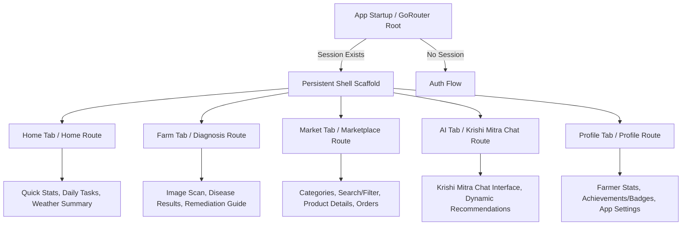
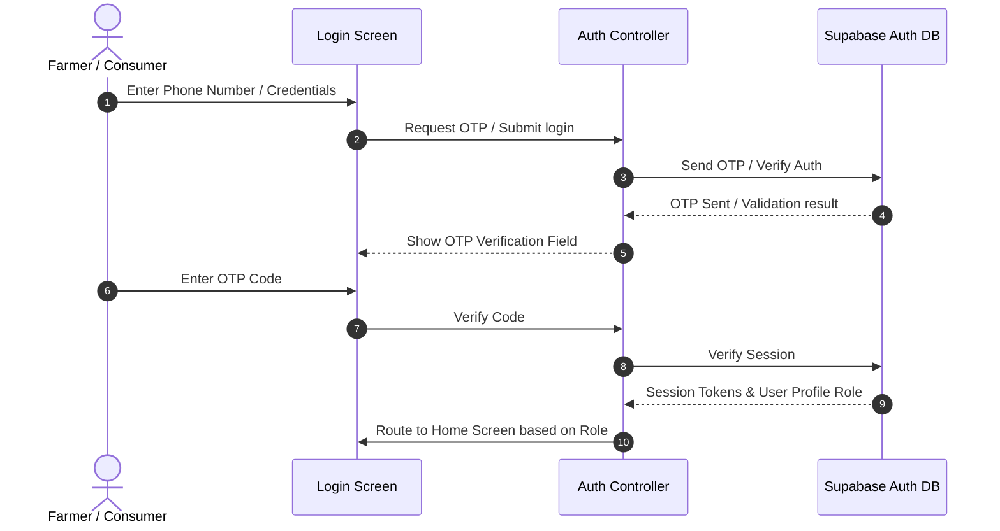
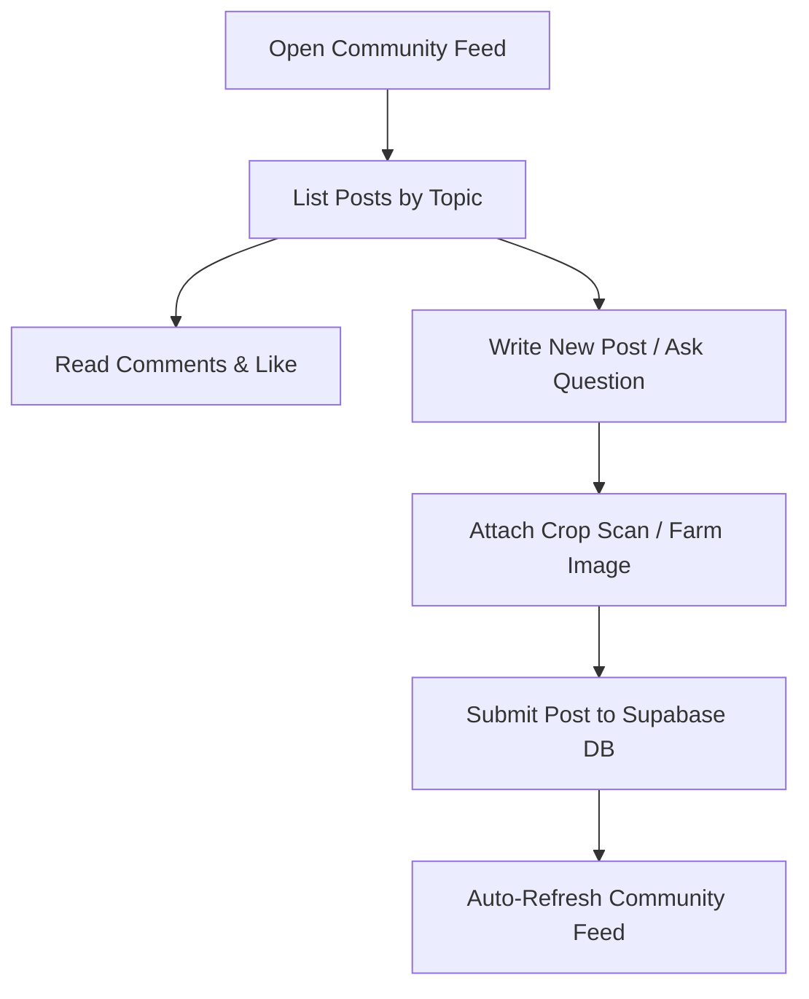
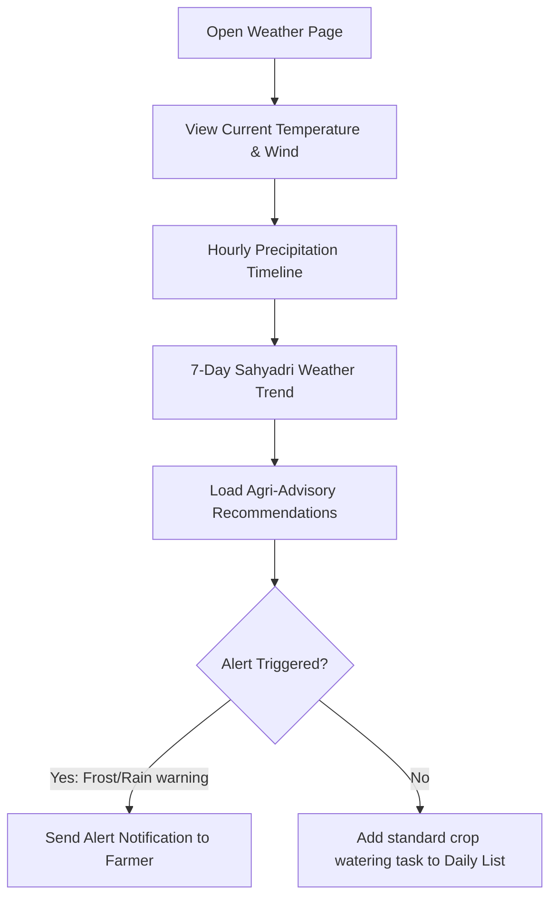

# Kalsubai Farms Information Architecture

This document defines the structural taxonomy, routing configurations, and interactive user flows of the Kalsubai Farms platform.

---

## 1. Application Navigation Flow (Shell Routing)

The platform is designed around a 5-tab persistent Bottom Navigation bar with GoRouter nested shell routes.



---

## 2. Authentication Flow

Supports OTP-based logins for farmers and email/social login for consumers via Supabase.



---

## 3. Crop Diagnosis Flow (Krishi Mitra AI)

Provides instant crop disease scanning with organic treatment recommendations.

```mermaid
flowchart TD
    Start[Open Diagnosis Tab] --> SelectSource{Capture or Upload?}
    SelectSource -->|Camera| Camera[Open Camera Capture]
    SelectSource -->|Gallery| Gallery[Open Image Gallery Picker]
    
    Camera --> Preview[Show Leaf Image Preview]
    Gallery --> Preview
    
    Preview --> Confirm[Upload & Analyze Image]
    Confirm --> Loader[Show Loading Mascot "Kalu Thinking"]
    
    Loader --> API[Request CropScan AI Endpoint]
    API --> Results{Disease Detected?}
    
    Results -->|Yes| DiseaseCard[Display Disease Detection Card]
    Results -->|No| HealthyCard[Display Healthy Leaf Confirmation]
    
    DiseaseCard --> Remedy[Load Organic Treatments & Prevention Guide]
    Remedy --> BuyInput[Action: Order Remedy from Marketplace]
    Remedy --> ShareInput[Action: Share to Community Forum]
```

---

## 4. Marketplace Flow

A clean direct-sales agriculture e-commerce flow.

```mermaid
flowchart LR
    Browse[Browse Marketplace] --> Filter[Filter by Category / Millet / Vegetable]
    Filter --> Search[Search Grains / Seeds]
    Search --> ProdCard[Click Product Card]
    ProdCard --> ProdDetails[View Product & Farmer Details]
    ProdDetails --> Cart[Add to Cart]
    Cart --> Checkout[Submit Order / Payment Method]
    Checkout --> Status[Confirm Order: Show "Kalu Success"]
```

---

## 5. Community Forum Flow

Combines social features with collaborative agricultural advice.



---

## 6. Weather Forecast & Recommendation Flow

Hyperlocal meteorological support tailored for mountain elevations.


