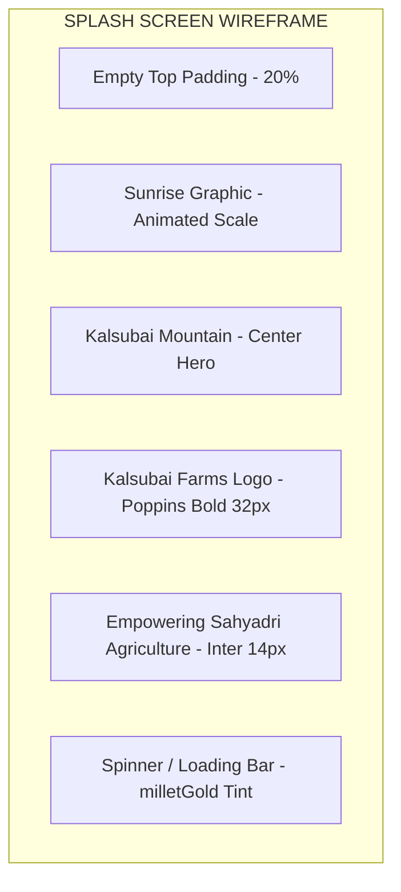
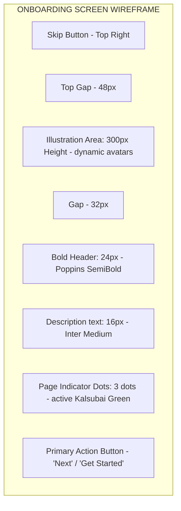

# Kalsubai Farms UI Wireframes

This document details the visual layout configurations for each of the core application screens, modeled using structural block diagrams.

---

## 1. Splash Screen



---

## 2. Onboarding Screen



---

## 3. Login Screen

```mermaid
graph TD
    subgraph LOGIN SCREEN WIREFRAME
        LangSelector[Language Selector Pills: EN | HI | MR]
        BrandHeader[Logo & Greeting: 'Welcome Back']
        PhoneField[Input: Mobile Phone Number - Small Radius]
        OtpField[Input: 6-Digit OTP - Hidden by Default]
        VerifyButton[Primary Button: 'Request OTP' / 'Verify']
        TermsText[Footer Links: Privacy Policy & Terms]
    end
```

---

## 4. Home Screen (Flagship Screen Layout)

```mermaid
graph TD
    subgraph HOME SCREEN FLAGSIP WIREFRAME
        HeroBlock[Mountain Hero Banner: 220px Height]
        HeroBlock --> HeroContent[Good Morning Ramesh! / Weather Alert: Sunny / Kalsubai BG]
        
        StatsRow[Quick Stats Scroll: 4 Cards]
        StatsRow --> StatsItems[Crops: 3 | Water: 85% | Livestock: 12 | Market: +4%]
        
        FeatureGrid[Feature Grid - 2x4 Layout]
        FeatureGrid --> Features[Diagnosis | Marketplace | Weather | Schemes | Soil | Cattle | Community | Passport]
        
        TaskPanel[Daily Task Checklist - Card base]
        TaskPanel --> Tasks[Water Bajra crops | Add Feed to Cattle | Check orders]
        
        MascotBanner[AI Advisor: Krishi Mitra Recommendation]
        MascotBanner --> AiAlert[Millet blight spotted nearby, click to check prevention measures]
    end
```

---

## 5. Farm Diagnosis Screen

```mermaid
graph TD
    subgraph FARM DIAGNOSIS SCREEN WIREFRAME
        Header[Scan Crop Leaf - back navigation]
        Selector[Pill Tabs: Image Upload | Camera Capture]
        UploadArea[Central Dropzone / Camera Viewport - Dotted outline]
        UploadArea --> ButtonAction[Tap to Capture leaf photo]
        
        LoadingPanel[Analysis Panel - Hidden by default]
        LoadingPanel --> MascotThinking[Kalu Mascot: Thinking animation]
        LoadingPanel --> ProgBar[Analysis Progress Bar]
        
        ResultCard[Disease Analysis Card]
        ResultCard --> DiseaseTitle[Leaf Blast Detected - 92% confidence]
        ResultCard --> Details[Symptoms: Brown spots on leaf blades]
        ResultCard --> ActionRemedy[Remedy: Organic Copper Fungicide Spray]
        ResultCard --> OrderBtn[Button: Purchase Remedy directly]
    end
```

---

## 6. Marketplace Screen

```mermaid
graph TD
    subgraph MARKETPLACE SCREEN WIREFRAME
        SearchBar[Search bar - Input prefix search icon]
        CatScroll[Category horizontal scroll: Grains | Seeds | Dairy | Fertilizers]
        
        ProductGrid[Product Grid - 2-Column Responsive]
        ProductGrid --> Card1[Finger Millet / Ramesh G. / Rs.45/kg / Organic Badge]
        ProductGrid --> Card2[Fresh Cow Milk / Gaikwad Farms / Rs.60/L / Dairy Badge]
        
        FilterFab[Floating Action Button - Filter & Sort parameters]
    end
```

---

## 7. Community Screen

```mermaid
graph TD
    subgraph COMMUNITY SCREEN WIREFRAME
        TagScroll[Horizontal Forum Tags: All | General | Millets | Livestock | Akole]
        WritePost[Header Input: 'Ask the community...' - Left user avatar]
        
        FeedList[Post Feed List]
        FeedList --> PostCard1[Ramesh G. / 2 hrs ago / 'Best fertilizer for Bajra?']
        PostCard1 --> Reactions[Likes: 14 | Comments: 8 | Share]
        
        FeedList --> PostCard2[Vidya G. / Soil Expert / 'Drone spray schedule']
    end
```

---

## 8. Weather Screen

```mermaid
graph TD
    subgraph WEATHER SCREEN WIREFRAME
        WeatherHero[Current Weather: 26°C - Cloudy / Rain cloud illustration]
        HourlyScroll[Hourly timeline: 1:00 PM (80% rain) | 2:00 PM (10% rain) | ...]
        WeeklyList[7-day Forecast list: Mon (24°/18°) | Tue (25°/19°) | ...]
        AdvisoryCard[Agricultural Weather Tip: Delay spraying copper fungicide for 24h]
    end
```

---

## 9. Profile Screen

```mermaid
graph TD
    subgraph PROFILE SCREEN WIREFRAME
        HeaderBlock[Farmer Avatar - Circle crop / Name: Ramesh / Location: Akole]
        BadgeSection[Achievements: Millet Champion Badge | Water Saver | Organic Hero]
        FarmStats[Analytics: 2.4 Hectares | 3 Crops | 18 Sales Orders]
        ActivityFeed[Recent posts & listings history]
    end
```

---

## 10. Settings Screen

```mermaid
graph TD
    subgraph SETTINGS SCREEN WIREFRAME
        Section1[Account Settings: Edit Farm Details | Language Toggle]
        Section2[App Preferences: Notifications Push | Dark Mode Switch]
        Section3[Offline Map Setup: Download Akole Map (32MB)]
        Section4[Support: Contact Krishi Mitra Support | Terms of Service]
    end
```
