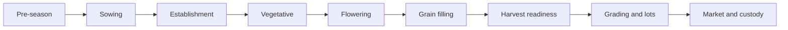

# MilletsNow Crop Stage, Weekly Suggestions, And Grading Expansion

Status: build expansion handoff  
Target: Flutter phone app  
Primary goal: make the app change with the crop lifecycle, then carry field evidence into grading, lots, passports, and market linkage

Use this as an add-on to:

- `plans/farmer_phone_app_full_survey_flow_and_claude_build_prompt.md`
- `plans/high_fidelity_wireframes.md`
- `docs/milletsnow-traceability-cim-market-linkage-project-brief.md`

## 1. Core Product Shift

The baseline survey should not remain the center of the app after onboarding. Once a farmer, farm, crop, and sowing date exist, the main app experience should switch from "collect survey data" to "manage the crop cycle week by week".

The app should feel different at each stage:

1. Pre-season: setup checklist and missing evidence.
2. Sowing: record sowing and seed/field details.
3. Establishment: stand check, gap check, early weed check, first photos.
4. Vegetative: diagnostics, weeding, weather, field visit tasks.
5. Flowering: pest/moisture watch and careful field verification.
6. Grain filling: crop stress, maturity preparation, harvest planning.
7. Harvest readiness: moisture, maturity, drying, sample prep.
8. Grading and lots: grade samples, lot split, QR, passport.
9. Market: offers, custody, buyer handoff.

The exact crop calendar must be configurable by crop, location, sowing date, and local agronomy guidance. The week examples below are product templates, not final agronomic prescriptions.

## 2. New Routes

Add or plan these routes:

```text
/crop-cycles/:id                    Stage-aware crop cycle dashboard
/crop-cycles/:id/timeline           Crop stage timeline
/crop-cycles/:id/weekly-plan        Week-by-week suggestions
/crop-cycles/:id/week/:weekNumber   Week detail
/suggestions/:id                    Suggestion detail and action capture
/crop-cycles/:id/field-check        Field check capture
/crop-cycles/:id/harvest-readiness  Harvest readiness dashboard
/harvest/:cropCycleId/grading       Grade sample capture
/harvest/:cropCycleId/grade-result  Grade result and lot split
/lots/:id/quality-passport          Buyer-safe quality passport
```

## 3. Data Objects To Add Or Model

| Object | Purpose |
| --- | --- |
| `crop_stage_template` | Defines stage names, week ranges, suggested checks, and evidence requirements by crop and region. |
| `crop_cycle_stage_state` | Stores current stage, current week, stage completion, and next best action. |
| `weekly_plan` | Generated from crop cycle, sowing date, crop template, weather, diagnostics, and field evidence. |
| `weekly_suggestion` | One recommendation or check for a specific week. |
| `suggestion_action` | Farmer or collector response: done, snoozed, photo added, note added, needs follow-up. |
| `field_check` | Structured observation with photos, status, and optional location. |
| `harvest_readiness_check` | Maturity, moisture, weather, drying, tools, and sample prep evidence. |
| `grade_sample` | Sample method, sample count, moisture reading, visual observations, photos, verifier. |
| `grade_result` | Field grade, verified grade, lab grade, evidence status, and quality factors. |
| `lot_split` | Creates separate lots by grade or quality condition. |
| `quality_passport` | Buyer-safe view of grade, sample evidence, lot ID, QR, and custody. |

## 4. Crop Stage State Machine

The UI should derive the active stage from:

- Crop type.
- Sowing date or transplant date.
- Crop-stage template.
- Farmer or field team overrides.
- Weather and diagnostics.
- Actual field checks.

Use this simple state flow:



The app must allow manual correction. Example: if sowing was delayed, the user should update the sowing date and regenerate the weekly plan.

## 5. How The Layout Changes By Stage

| Stage | Home layout priority | Primary CTA | Main cards | Evidence collected |
| --- | --- | --- | --- | --- |
| Pre-season | Setup checklist | Start Crop Cycle | Survey complete, boundary, crop, offline map, sowing window | Farmer, farm, crop, boundary, planned dates |
| Sowing | Record event | Record Sowing | Seed source, sowing date, area, field photo | Sowing event, seed evidence, field photo |
| Establishment | Stand and gap check | Record Field Check | Emergence, gaps, rainfall, early weeds | Photo, notes, gap status |
| Vegetative | Crop care and diagnostics | Run Diagnostics | NDVI trend, weeding, pest watch, weather | Diagnostic result, field visit, weed note |
| Flowering | Risk watch | Record Flowering Check | Pest watch, moisture, weather alerts, field verification | Photo, pest observation, alert response |
| Grain filling | Stress and maturity prep | Check Grain Filling | Moisture stress, bird watch, expected harvest window | Field photo, maturity note, weather window |
| Harvest readiness | Harvest prep | Start Harvest And Grading | Readiness score, moisture, drying, tools, sample bags | Moisture, maturity signs, drying setup |
| Grading and lots | Quality capture | Start Grade Sample | Moisture, purity, damaged grain, photos, verifier | Grade sample, photos, grade result |
| Market | Buyer readiness | View Buyer Matches | Passport score, grade, quantity, offers, custody | Lot ID, QR, offer, custody event |

## 6. Stage-Aware Dashboard Rules

The crop cycle dashboard should keep the same shell but swap the main content.

Always show:

- Farmer and farm.
- Crop cycle name.
- Current week and stage.
- Offline or sync status.
- Stage timeline chips.
- Next best action.
- Evidence status.

Change by stage:

- Pre-season shows setup checklist.
- Establishment shows stand check and photo capture.
- Vegetative shows diagnostics and weeding reminders.
- Flowering shows pest/moisture watch.
- Grain filling shows maturity and stress checks.
- Harvest readiness shows harvest and grading preparation.
- Post-harvest shows lot, passport, custody, and buyer actions.

## 7. Week-By-Week Suggestion Template

This is a product template for ragi, bajra, and similar millet flows. Final content must be approved by local agronomy teams and configured per crop.

| Week | Stage | App layout emphasis | Example suggestion types | Evidence |
| --- | --- | --- | --- | --- |
| Week 0 | Pre-season | Setup checklist | Complete survey, confirm boundary, download map, set sowing window | Survey, boundary, crop choice |
| Week 1 | Sowing | Record sowing | Record sowing date, seed source, field photo | Sowing event, photo |
| Week 2 | Establishment | Stand check | Check germination, note gaps, take photo | Field check, photo |
| Week 3 | Establishment | Gap and weed check | Check gaps, early weed observation, rain watch | Field note, photo |
| Week 4 | Vegetative | Crop care | Weed check, field visit, weather watch | Field visit, weed status |
| Week 5 | Vegetative | Weekly plan | Weed pressure, field photo, diagnostics due | Suggestion actions |
| Week 6 | Vegetative | Diagnostics | Run satellite diagnostics, pest watch, weather risk | Diagnostic result, field check |
| Week 7 | Pre-flowering | Risk watch | Moisture watch, pest scouting, field verification | Photo, notes |
| Week 8 | Flowering | Flowering check | Flowering progress, pest observation, rain/wind risk | Observation, alert response |
| Week 9 | Flowering | Follow-up | Follow-up on previous issues, recovery photo | Follow-up evidence |
| Week 10 | Grain filling | Stress check | Grain filling observation, moisture stress watch | Field check, photo |
| Week 11 | Grain filling | Harvest prep | Maturity signs, drying setup, harvest planning | Maturity note, weather window |
| Week 12 | Harvest readiness | Readiness score | Moisture check, sample bags, tools, harvest date | Moisture, readiness checklist |
| Week 13 | Harvest and grading | Grade sample | Capture grade sample, lot split, create QR | Grade sample, lot ID |
| Post-harvest | Storage and market | Passport and offers | Drying follow-up, storage status, buyer matches | Custody, passport, offer |

## 8. Weekly Plan Screen

Purpose: tell the farmer or collector what matters this week.

Layout:

- App bar: "Weekly Plan".
- Crop cycle header: crop, season, farm, village.
- Week timeline: W1 to W13, current week highlighted.
- Stage chip: Establishment, Vegetative, Flowering, etc.
- Sync chip.
- Grouped suggestions:
  - Today.
  - This week.
  - Upcoming.
- Floating add button for note, photo, or field check.

Each suggestion row should show:

- Icon.
- Title.
- Short reason.
- Priority.
- Source: survey, crop stage, weather, satellite, field, agronomist.
- Status: not started, done, needs field check, snoozed.

## 9. Week Detail Screen

Purpose: show all tasks for a specific week with sources and action status.

Sections:

- Week window.
- Priority actions.
- Field checks.
- Weather window.
- Diagnostic signals.
- Completed actions.

Actions:

- Mark done.
- Add note.
- Record photo.
- Snooze.
- Ask agronomist.
- Link to diagnostics.

## 10. Suggestion Detail Screen

Purpose: explain why the app is suggesting an action.

Required sections:

- Suggestion title.
- Status.
- Why now.
- Local evidence.
- Farmer-safe instruction.
- Checklist.
- Action buttons.

Copy rules:

- Say "suggestion", not "prescription".
- Say "needs field check" when evidence is indirect.
- Do not provide exact input dosage unless a trusted local Package of Practice source is linked.
- Do not claim disease certainty from satellite or weak photo evidence.

## 11. Crop Stage Timeline Screen

Purpose: show where the crop is in the full lifecycle.

Layout:

- Crop cycle header.
- Total planned duration.
- Vertical stage list:
  - Setup.
  - Sowing.
  - Establishment.
  - Vegetative.
  - Flowering.
  - Grain filling.
  - Harvest.
  - Post-harvest.
- Each stage row:
  - Week range.
  - Key tasks.
  - Alerts count.
  - Completion percent.
  - Evidence state.
- CTA: Update Sowing Date.

Acceptance:

- Updating the sowing date should shift the week timeline.
- Completed evidence remains attached to actual dates.

## 12. Grading Flow Overview

Grading starts before the buyer passport. The app should separate:

1. Harvest readiness.
2. Field grade sample.
3. Verified grade.
4. Lab grade, if available.
5. Buyer-facing quality passport.

Do not collapse these into one "grade" field. Buyers need to know whether the grade was self reported, field estimated, verified by staff, or lab backed.

## 13. Harvest Readiness And Grade Prep Screen

Purpose: decide whether the crop is ready to harvest and whether grade evidence can be captured.

Layout:

- Crop and season header.
- Harvest readiness score.
- Expected harvest window.
- Maturity signs checklist.
- Weather window.
- Grade prep checklist:
  - Clean harvesting tools.
  - Drying area ready.
  - Sample bags ready.
  - Moisture meter ready.
  - Weighing scale ready.
  - Lab sample bags, if needed.
- Pending evidence:
  - Grade sample.
  - Drying photos.
  - Moisture reading.

CTA:

- Start Grade Sample.

## 14. Grade Sample Capture Screen

Purpose: collect quality observations from a representative sample.

Fields:

- Crop.
- Farm.
- Date and time.
- Verifier.
- Sample method:
  - Multiple bag.
  - Field point.
  - Heap or bulk.
  - Custom.
- Number of bags or field points.
- Moisture reading, percent.
- Foreign matter:
  - None or very little.
  - Some.
  - High.
- Damaged or broken grains:
  - None.
  - 1 to 5 percent.
  - 6 to 15 percent.
  - More than 15 percent.
- Grain color and uniformity:
  - Good.
  - Moderate.
  - Poor.
- Smell or infestation:
  - Good.
  - Musty or infected.
- Photos:
  - Sample close-up.
  - Spread sample.
  - Bag or heap.
  - Moisture meter, if possible.

Acceptance:

- Grade sample can save offline.
- Photos are linked to the sample.
- Moisture range warnings are configurable by crop and buyer requirement.

## 15. Grade Result And Lot Split Screen

Purpose: summarize grade evidence and create separate lots when quality varies.

Layout:

- Suggested field grade.
- Evidence status:
  - self reported.
  - field estimated.
  - verified.
  - lab pending.
  - lab verified.
- Quality factors:
  - Moisture.
  - Purity.
  - Damaged or broken grains.
  - Foreign matter.
  - Grain color and uniformity.
  - Smell or infestation.
- Sample evidence.
- Lot split by grade:
  - Grade A quantity.
  - Grade B quantity.
  - Grade C or needs drying quantity.

Acceptance:

- The app should allow one harvest to become multiple lots by grade.
- Lot quantity totals must equal or be less than total harvest quantity.
- A warning should appear if split quantities exceed total harvest quantity.
- Lower grade or needs drying lots should still be traceable.

## 16. Buyer Quality Passport Screen

Purpose: show grade proof without exposing sensitive farmer data.

Buyer view should show:

- Lot ID.
- QR code.
- Crop.
- Village or cluster.
- Harvest date.
- Quantity.
- Grade.
- Moisture reading and source.
- Purity or quality summary.
- Sample date.
- Verifier type, not sensitive personal details.
- Lab status.
- Evidence completeness.
- Custody timeline.

Buyer view should hide:

- Full phone number.
- Aadhaar.
- Exact farmer address.
- Private notes.
- Internal staff comments.

## 17. Grade Labels

Use flexible grade labels because buyers and FPOs may use different standards.

Recommended default labels:

| Grade | Meaning in app | Buyer wording |
| --- | --- | --- |
| Grade A | Best quality lot for premium or direct buyer matching | Premium quality |
| Grade B | Standard marketable lot | Standard quality |
| Grade C | Lower quality, still traceable | Economy quality |
| Needs drying | Moisture too high or drying incomplete | Not market ready |
| Needs cleaning | Foreign matter or impurity too high | Re-clean before sale |
| Recheck | Evidence conflict or missing verification | Verification needed |

## 18. How Grading Changes The App Layout

Before harvest:

- Main CTA: "Start Harvest And Grading".
- Cards: harvest readiness, drying setup, pending evidence.
- Diagnostics still visible but secondary.

During grading:

- Main CTA: "Save Sample".
- Forms replace advisory cards.
- Photo capture becomes primary.
- Evidence status is visible near grade result.

After grading:

- Main CTA: "Create Lots" or "View Passport".
- Lot cards replace crop-stage suggestions.
- Buyer match and custody actions appear.
- Weekly suggestions move to post-harvest reminders.

## 19. Alert And Suggestion Severity

Use simple severity:

| Severity | UI color role | Meaning |
| --- | --- | --- |
| Info | Blue or gray | Helpful reminder. |
| Recommended | Green | Useful action this week. |
| Watch | Amber | Check conditions soon. |
| Needs field check | Orange | Evidence is indirect or risk is rising. |
| Warning | Red | Time-sensitive follow-up needed. |
| Blocked | Red/gray | Missing required evidence or invalid state. |

## 20. Stage-Specific Bottom Navigation

Keep the same bottom navigation, but allow context badges:

```text
Home
Weekly Plan
Fields
Market
More
```

During harvest and grading, the active tab can remain Fields or Market depending on product choice, but show a persistent crop cycle header so the user knows which field and lot they are working on.

## 21. Builder Prompt Add-On

Use this as an add-on to the existing Claude build prompt.

```text
Expand the MilletsNow phone app beyond baseline survey into a crop-cycle-aware app.

Add stage-aware crop cycle screens:
- crop cycle dashboard
- weekly plan overview
- week detail
- suggestion detail
- crop stage timeline
- harvest readiness
- grade sample capture
- grade result and lot split
- buyer quality passport

The app layout must change by crop stage. Before sowing, show setup checklist. During establishment, show stand check and field photo. During vegetative growth, show diagnostics and weeding reminders. During flowering, show pest and moisture watch. During grain filling, show maturity and harvest preparation. During harvest, show readiness and grading. After harvest, show lots, passport, custody, and buyer offers.

Build week-by-week suggestions from a configurable crop-stage template. Suggestions must be evidence tagged with source labels: crop stage, survey, weather, satellite, field, agronomist. Suggestion status must support not started, done, needs field check, snoozed, and follow-up needed.

Add grading support:
- harvest readiness score
- grade prep checklist
- representative grade sample capture
- moisture reading
- foreign matter
- damaged or broken grains
- grain color and uniformity
- smell or infestation
- photo evidence
- verifier
- field grade
- verified grade
- lab grade if available
- lot split by grade
- buyer-safe quality passport

Keep agronomy language safe. Do not give exact input doses, exact pH claims, disease certainty, or guaranteed yield unless the app has trusted local evidence and explicit agronomist-approved content. Use "suggestion", "needs field check", and "based on available evidence" where appropriate.

Use the new visual boards:
- plans/wireframes/crop-stage-adaptive-layout-flow.png
- plans/wireframes/weekly-suggestions-flow.png
- plans/wireframes/grading-quality-flow.png
```

## 22. Acceptance Tests

### Stage layout shift

1. Create a crop cycle with sowing date.
2. Open crop cycle dashboard.
3. Change sowing date to move the crop from Week 2 to Week 6.

Expected:

- Stage chip changes.
- Next best action changes.
- Home cards change from stand check to diagnostics and crop care.

### Weekly suggestion action

1. Open Weekly Plan.
2. Open one suggestion.
3. Add photo.
4. Mark done.

Expected:

- Suggestion status changes to done.
- Photo is linked as evidence.
- Weekly completion updates.

### Needs field check

1. Trigger or mock a satellite moisture concern.
2. Open suggestion detail.

Expected:

- Suggestion uses needs field check language.
- User can record photo and note.
- App does not claim confirmed disease or exact input dose.

### Grade sample

1. Open Harvest Readiness.
2. Start Grade Sample.
3. Enter moisture, quality observations, and photos.
4. Save sample offline.

Expected:

- Sample is saved.
- Evidence status is self reported or field estimated.
- Pending sync is visible if offline.

### Lot split

1. Open Grade Result.
2. Split total quantity into Grade A, Grade B, and Needs drying.
3. Try exceeding total harvest quantity.

Expected:

- Valid split can create lots.
- Invalid split shows warning.
- Each lot keeps traceability back to crop cycle and grade sample.
