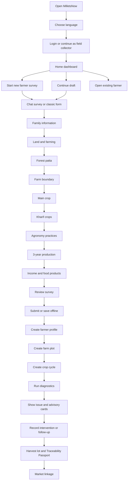
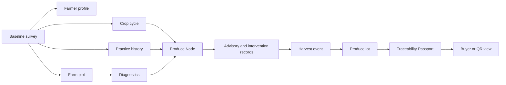

# MilletsNow Farmer Phone App Full Survey Flow And Claude Build Prompt

Status: build handoff plan  
Target: Flutter phone app for farmers, field collectors, FPO teams, and MilletsNow operations  
Primary repo area: `millets-now-mobile`  
Design source: current MilletsNow Flutter app, baseline survey docs, traceability CIM brief, and the diagnostic map screenshot shared in chat

## 1. Product Design Brief

### What the app should do

Build a farmer-first MilletsNow phone app that helps field teams and farmers:

1. Register and identify a farmer.
2. Capture a full baseline survey in a field-friendly way.
3. Draw or confirm the farm boundary.
4. Connect the farmer, field, crop cycle, and survey answers into a traceability-ready Produce Node.
5. Run or view farm diagnostics using satellite and weather signals.
6. Show farmer-safe advisory and verification steps.
7. Prepare harvest lots, QR identity, and buyer-facing traceability passports.
8. Work offline during field visits and sync later.

### Visual source to match

Use the existing MilletsNow Flutter style:

- Brand greens from `lib/config/theme.dart`: deep green, light green, pale green, white surface, muted gray text.
- Current survey list, chat survey, classic survey stepper, offline maps, and satellite diagnostics patterns.
- The uploaded diagnostic dashboard screenshot:
  - Large satellite map.
  - Farm polygon boundary.
  - Problem markers on the map.
  - Farm health summary with percentage, total cells, healthy cells, problem areas, critical areas.
  - Weather card.
  - Detected issue chips for nitrogen, soil moisture, and phosphorus.

For phone, do not copy the desktop two-column layout. Convert it into a vertical phone layout with a large map, a sticky or draggable bottom sheet, compact issue chips, and clear action buttons.

### Interactivity level

Full app interactivity for core flows:

- Language selection must switch visible labels.
- Survey answers must save as draft.
- Required-field validation must be visible before submit.
- Conditional fields must appear immediately.
- Repeat groups must allow add, edit, remove, and review.
- Farm boundary drawing must support save, undo, clear, and skip when optional.
- Diagnostics screen must support farm selection, index selection, run diagnostics, issue cards, weather summary, and advisory detail.
- Offline mode must show saved drafts, pending sync, and map download status.

## 2. Build Goals

The build should feel like a practical field tool, not a marketing app.

The first screen after login should help a field collector take action quickly: continue a draft, start a new survey, open a farmer record, download maps, or view diagnostics.

The app should be usable in villages where:

- Network is unreliable.
- Marathi, Hindi, and English may all be needed.
- Field workers need large touch targets and minimal typing.
- Farmers may not understand technical satellite language.
- Data quality matters because the same records feed traceability, market linkage, diagnostics, and buyer confidence.

## 3. Existing Repo Anchors

Use the current structure instead of starting a new app.

Important files:

- `lib/app.dart`: current GetX routes.
- `lib/config/theme.dart`: brand theme.
- `lib/screens/landing_screen.dart`: current module chooser.
- `lib/screens/home_screen.dart`: survey list and pending submissions.
- `lib/screens/chatbot_survey_screen.dart`: chat-first survey route at `/form`.
- `lib/screens/survey_form_screen.dart`: classic stepper route at `/form/classic`.
- `lib/screens/offline_maps_screen.dart`: offline map surface.
- `lib/screens/diagnostics_home_screen.dart`: current simple diagnostics screen.
- `lib/screens/satellite/diagnostics_screen.dart`: richer diagnostics tab.
- `lib/screens/satellite/draw_polygon_screen.dart`: map polygon capture pattern.
- `baseline_survey_form_tree.md`: full survey tree.
- `plans/baseline_survey_updated_flow_translations.md`: latest survey flow and translation fixes.
- `plans/crop_stage_grading_weekly_layout_expansion.md`: crop-stage layouts, weekly suggestions, and grading flow.
- `plans/high_fidelity_wireframes.md`: high-fidelity visual boards for survey, diagnostics, traceability, crop stages, weekly plan, and grading.
- `../docs/milletsnow-traceability-cim-market-linkage-project-brief.md`: CIM, Produce Node, Traceability Passport, and market linkage brief.

Current routes in `lib/app.dart`:

```text
/                  SplashScreen
/login             MainLoginScreen
/home              LandingScreen
/surveys           HomeScreen
/form              ChatbotSurveyScreen
/form/classic      SurveyFormScreen
/diagnostics       DiagnosticsHomeScreen
/offline-maps      OfflineMapsScreen
```

Recommended new or expanded routes:

```text
/farmer/:id                 Farmer profile and crop cycles
/survey/review              Survey review before submit
/farms/:id                  Farm profile
/farms/:id/diagnostics      Phone-optimized diagnostic map
/farms/:id/advisory         Advisory and verification steps
/traceability/:cropCycleId  Produce Node and passport readiness
/harvest/new                Harvest lot creation
/market/lots                Market-ready lots
/settings                   Language, sync, profile, support
/crop-cycles/:id            Stage-aware crop cycle dashboard
/crop-cycles/:id/weekly-plan Week-by-week suggestions
/crop-cycles/:id/timeline   Crop stage timeline
/harvest/:cropCycleId/grading Grade sample capture
/lots/:id/quality-passport  Buyer-safe quality passport
```

## 4. Information Architecture

Use a bottom navigation app shell after login.

Recommended bottom tabs:

1. Home
2. Surveys
3. Farms
4. Diagnostics
5. Market

If five tabs feel too dense on smaller phones, combine Diagnostics under Farms and use four tabs:

1. Home
2. Surveys
3. Farms
4. Market

Home should still expose diagnostics and offline maps as quick actions.

## 5. End To End Farmer Flow



## 6. Field Data To Traceability Flow

The survey is not only a form. It is the first data source for traceability.



Core traceability entities to keep in mind:

| Entity | App source |
| --- | --- |
| `farmer` | Family Information section |
| `farm_plot` | Land/Farming plus Farm Boundary |
| `crop_cycle` | Main Crop, Kharif Crops, season context |
| `activity_event` | Agronomy practice fields |
| `observation` | Diagnostics, photos, pest/growth fields, WhatsApp messages |
| `advisory` | Diagnostic interpretation and farmer-safe next steps |
| `intervention` | Farmer action after advisory |
| `harvest_event` | Harvest fields and future harvest screen |
| `produce_lot` | Harvest lot creation and QR |
| `custody_event` | Aggregator, FPO, storage, transport, processor handoff |
| `market_offer` | Buyer demand, reservation, price, sale status |

## 7. Visual System

### Overall look

Use a quiet agricultural operations style:

- Background: `AppTheme.surface`.
- Primary actions: deep green buttons.
- Cards: white, thin gray border, radius 8 to 12.
- Avoid heavy shadows.
- Avoid decorative gradients.
- Keep cards for actual repeated objects or framed tools, not every page section.
- Use icons inside buttons where possible.
- Keep the app dense enough for field work but still readable.

### Phone layout rules

- Minimum touch target: 44px.
- Bottom buttons must stay clear of gesture navigation.
- Forms should not require horizontal scrolling.
- Long labels can wrap to two lines.
- Put units directly in fields: acre, days, Rs, cm, kg, quintal.
- Required fields should show a small required mark and friendly validation text.
- The offline/sync state should always be visible as a compact banner, chip, or icon.
- Show progress with a step count and section chips, not a full desktop wizard.

### Farmer-friendly language

Use plain labels:

- Say "Chemical" instead of "Inorganic".
- Say "Package of Practice" instead of "POP".
- Say "Disease control" instead of wording that implies fertilizer helps disease grow.
- For diagnostics, say "Needs field check" instead of "confirmed disease" unless there is trusted local evidence.
- Do not make exact fertilizer, pH, nutrient-dose, or yield claims from satellite data alone.

## 8. Screen By Screen App Plan

Each screen below includes a layout image brief that can be used as a mockup prompt for Claude, Figma, or image generation.

### Screen 1. Splash

Purpose: Load startup controllers, check auth, restore language, and show brand.

Layout image brief:

```text
Phone screen with white background, centered MilletsNow logo, small "wrkFarm" brand text below, subtle green loading spinner near bottom, no marketing copy.
```

Interactions:

- If authenticated, route to `/home`.
- If not authenticated, route to `/login`.
- If startup sync fails, continue to login or home and show offline status later.

Acceptance:

- No blocking network dependency.
- Does not show debug banners.

### Screen 2. Language And Role Setup

Purpose: Choose language and working mode before long forms.

Layout image brief:

```text
Phone screen with MilletsNow header, three large language buttons for English, Hindi, Marathi, then role choices: Farmer, Field Collector, FPO/Admin. Primary button says Continue.
```

Key UI:

- Language segmented control.
- Role cards with icons.
- Continue button fixed near bottom.

Acceptance:

- Labels update immediately after language selection.
- Role selection can be saved locally.

### Screen 3. Login

Purpose: Sign in field collector or farmer.

Layout image brief:

```text
Phone login with compact logo at top, phone/email input, password or OTP option, green Sign in button, secondary "Continue offline" for collectors with local draft access.
```

Interactions:

- Supabase auth if online.
- Offline mode may allow local draft capture but must queue sync.
- Show clear error if credentials fail.

### Screen 4. Home Dashboard

Purpose: The main action hub.

Layout image brief:

```text
Phone dashboard with top greeting, sync chip, weather mini card, four quick action tiles: New Survey, Continue Draft, Diagnostics, Offline Maps. Below that, "Today" list showing pending sync, incomplete surveys, recent farmers.
```

Suggested sections:

- Header: "MilletsNow" plus language/profile icon.
- Status row: Online or Offline, pending sync count.
- Quick actions:
  - New Survey
  - Farmer List
  - Diagnostics
  - Offline Maps
- Recent activity:
  - Draft surveys
  - Pending submissions
  - Recently opened farmers

Acceptance:

- The user can start field work in one tap.
- Offline state is obvious.

### Screen 5. Survey List

Purpose: Browse surveys and pending submissions.

Layout image brief:

```text
Phone list screen titled Farmer Baseline Surveys, count chip at top, search bar, filters for Draft, Synced, Pending, then farmer survey cards with name, village, crop, sync state, and edit button.
```

Use current `HomeScreen` patterns:

- Survey count chip.
- Pull to refresh.
- Empty state with New Survey and Offline Maps actions.
- Pending submissions visible with warning/clock style.

Acceptance:

- Search works by farmer name, village, phone, and crop.
- Pending offline submissions are not hidden.

### Screen 6. New Survey Entry

Purpose: Let the collector choose chat-first or classic form.

Layout image brief:

```text
Phone screen with title "New Baseline Survey", two large option rows: Guided Chat Survey and Classic Form. Chat option is recommended. Below, small note about drafts and offline saving.
```

Interactions:

- Guided Chat Survey routes to `/form`.
- Classic Form routes to `/form/classic`.
- If a draft exists, show Continue Draft first.

Acceptance:

- User never loses an existing draft by starting a new one without confirmation.

### Screen 7. Chat Survey

Purpose: Field-friendly one-question-at-a-time survey.

Current source: `ChatbotSurveyScreen`.

Layout image brief:

```text
Phone chat screen with app bar "Baseline Survey", bot question bubble, user's latest answer bubble, floating answer bar at bottom. For dropdowns show large choice chips. For numeric fields show unit suffix. For required fields show a small star in the bot prompt.
```

Important behavior:

- Only show the latest active question and immediate context, not a long chat history.
- Keep the answer bar above keyboard.
- Support skip only for optional fields.
- For polygon fields, show a map prompt widget instead of text input.
- For repeat groups, show a compact row builder.

Acceptance:

- Draft persists when app goes to background.
- Answer summary can be reviewed before submit.
- Chat can switch to classic form without losing answers.

### Screen 8. Classic Survey Stepper

Purpose: Fast form entry for trained collectors.

Current source: `SurveyFormScreen`.

Layout image brief:

```text
Phone form screen with app bar "New Survey", language toggle, horizontal step chips under app bar, section title, stacked input fields, bottom Previous and Next buttons. Completed chips show check icon, skipped chips show warning.
```

Important behavior:

- Keep horizontal step chips.
- Current chip should stay visible.
- Show required fields clearly.
- When user jumps to another section, save current field state.

Acceptance:

- Works in English, Hindi, Marathi.
- No field label remains English when Marathi or Hindi is selected.

### Screen 9. Survey Section: Language

Purpose: Set survey language.

Layout image brief:

```text
Simple phone step with three large language chips and a short label asking which language to use for the survey.
```

Fields:

- English
- Hindi
- Marathi

Acceptance:

- Changing language updates survey labels, options, buttons, helper text, and validation messages.

### Screen 10. Survey Section: Family Information

Purpose: Identify the farmer and household.

Layout image brief:

```text
Phone form section with progress chip "1 of 10", farmer icon, stacked fields for Farmer Name, Village, Gram Panchayat, Taluka, District, Mobile Number, Aadhaar Number, Date of Birth, Education, Gender, Social Category.
```

Fields:

- Farmer Name, required.
- Village, required.
- Gram Panchayat, required.
- Taluka, required.
- District, required.
- Mobile Number, 10 digits.
- Aadhaar Number, 12 digits.
- Date of Birth, no future dates.
- Education.
- Gender.
- Social Category.

Acceptance:

- Date picker saves selected date after OK.
- Future dates are disabled.
- Mobile and Aadhaar validation are friendly and local.
- Aadhaar should be masked in list and review views unless explicitly opened.

### Screen 11. Survey Section: Land And Farming

Purpose: Capture land and livelihood context.

Layout image brief:

```text
Phone section with land icon, multi-select chips for income sources and farming type, yes/no toggle for owns farmland, acre inputs in a two-column responsive grid where possible, total land at top.
```

Fields:

- Income sources, required, multi-select.
- Farming type, required, multi-select.
- Owns farmland, required, yes/no.
- Total land area, required, acre.
- Irrigated land, acre.
- Dry or unirrigated land, acre.
- Fallow land, acre.
- Leased land, acre.
- Rainfed area, acre.

Conditional logic:

- If Income sources includes Other, show "Please specify other income source".
- If Farming type includes Other, show "Please specify other farming type".

Acceptance:

- Acre fields accept decimals.
- Total land should not be silently overwritten unless auto-calc is explicitly designed.

### Screen 12. Survey Section: Forest Patta

Purpose: Capture forest land status.

Layout image brief:

```text
Phone section with forest icon, yes/no card "Has forest patta?", then either forest patta area input or "Applied for forest patta?" toggle.
```

Fields:

- Has forest patta, required.
- If yes: Forest patta area, acre.
- If no: Applied for forest patta, yes/no.

Acceptance:

- Only relevant conditional fields appear.

### Screen 13. Farm Boundary

Purpose: Capture or skip farm polygon.

Layout image brief:

```text
Phone map screen with satellite or street map background, top instruction "Draw farm boundary", undo and clear icons, visible polygon points, bottom sheet showing point count, estimated area, Save Boundary, and Skip for now.
```

Current source:

- `DrawPolygonScreen`
- `polygon_map_field.dart`
- `pencil_polygon_screen.dart`

Rules:

- Boundary is optional for baseline submission if field time is short.
- If drawn, require at least 3 points.
- Show area estimate if available.
- Allow offline map background.

Acceptance:

- Save, undo, clear, and skip all work.
- App does not block survey submission only because polygon is missing.

### Screen 14. Main Crop

Purpose: Identify primary crop and land area.

Layout image brief:

```text
Phone section with crop icon, large crop choice cards for Paddy/Rice, Nachani/Ragi, Bajra/Pearl millet, and Other if supported, followed by Land under main crop input.
```

Fields:

- Main crop, required.
- Land under main crop, acre.

Recommended wording:

- Paddy / Rice
- Nachani / Ragi
- Bajra / Pearl millet

Acceptance:

- Crop selection determines crop-specific helper text but should not create duplicate sections.

### Screen 15. Kharif Crops Repeat Group

Purpose: Capture up to 4 Kharif crop rows.

Layout image brief:

```text
Phone repeat group screen with title "Crops taken in Kharif season", saved row cards, Add Crop button, bottom sheet row editor with crop name, cultivated area, variety, production quantity, average estimated cost.
```

Fields per row:

- Crop name.
- Cultivated area, acre.
- Variety.
- Production quantity.
- Average estimated cost, Rs.

Options:

- Paddy / Rice
- Nachani / Ragi
- Bajra / Pearl millet
- Other

Conditional logic:

- If Other selected, show Other crop name and Other crop details.

Acceptance:

- Use one common Kharif Crops repeat group.
- Do not keep a duplicate Other Crops section.
- Limit to 4 rows unless requirements change.
- Row cards show crop name, area, and production at a glance.

### Screen 16. Agronomy Overview

Purpose: Break the long agronomy survey into manageable substeps.

Layout image brief:

```text
Phone screen with timeline-style list of agronomy substeps: Location and Training, Seed and Land Preparation, Sowing and Crop Care, Pest Growth and Harvest. Each row has completion state and opens its substep.
```

Why:

The agronomy section is long. Do not present every field as one endless scroll.

Acceptance:

- Substeps are easy to resume.
- Completion state is visible.

### Screen 17. Agronomy: Location And Training

Purpose: Capture where and how the crop is grown.

Layout image brief:

```text
Phone form with land location choice chips, same land every year toggle, land topology chips, seed source multi-select, Package of Practice training toggle, training source field, farming method choices.
```

Fields:

- Where is the main crop grown?
  - Own land
  - Forest patta
  - Leased land
  - Other
- Same land every year, yes/no.
- Land topology:
  - Flat
  - Sloped
  - Terraced
  - Hilly
  - Other
- Seed sources, multi-select:
  - Own saved
  - Local market
  - Government source
  - Neighbour
  - Co-operative society
  - Other
- Package of Practice training received, yes/no.
- If yes: Training source.
- Farming method:
  - Organic
  - Chemical
  - Mixed
  - Natural

Conditional logic:

- Every Other option reveals a specify field immediately.

### Screen 18. Agronomy: Seed And Land Preparation

Purpose: Capture seed treatment and land preparation cost.

Layout image brief:

```text
Phone form with seed treatment toggle, treatment material chips, sowing method cards, seedling days input, difference noticed text area, tractor and bullock cost inputs, hand preparation toggle.
```

Fields:

- Treats seeds, yes/no.
- If yes: Seed treatment materials, multi-select.
- Seedling or sowing method.
- Seedlings ready after, days.
- Difference noticed.
- Tractor days.
- Tractor cost, Rs.
- Bullock days.
- Bullock cost, Rs.
- Land prepared by hand, yes/no.

### Screen 19. Agronomy: Sowing Or Transplanting And Crop Care

Purpose: Capture transplanting, labour, spacing, and weeding.

Layout image brief:

```text
Phone form with sowing/transplanting method cards, Jeevamrut dip toggle, plant spacing field with cm suffix, labour fields that appear only when labour is needed, weeding toggle and days input.
```

Fields:

- Sowing or transplanting method.
- Dip seedlings in Jeevamrut, yes/no.
- Plant spacing, cm.
- Transplanting days.
- Needs transplanting labour, yes/no.
- If yes: Number of labourers.
- If yes: Daily wage, Rs.
- Does weeding, yes/no.
- If yes: Weeding after, days.

### Screen 20. Agronomy: Pest Growth And Harvest

Purpose: Capture pest practices, growth timings, harvest labour, and sale timing.

Layout image brief:

```text
Phone form with pest control toggle, spray method chips, conditional quantity fields per selected method, disease-control question, growth day inputs, fertilizer fields, monitoring chips, harvest method cards, sell timing choices.
```

Fields:

- Sprays for pest control, yes/no.
- If yes: Spray methods, multi-select:
  - Neem
  - Matka
  - Jeevamrut
  - Pesticide
  - Other
- If Neem selected: Neem quantity per acre.
- If Matka selected: Matka quantity per acre.
- If Jeevamrut selected: Jeevamrut quantity per acre.
- If Pesticide selected: Pesticide quantity per acre.
- If Other selected: Please specify other spray details.
- Does organic fertilizer help in disease control, yes/no.
- Planting to flowering, days.
- Uses fertilizer, yes/no.
- If yes: Fertilizer names.
- If yes: Quantity per acre.
- Pest problem during flowering, yes/no.
- If yes: Pest type.
- If yes: Sprays used.
- Maturity, days.
- Monitors crop, yes/no.
- If yes: Monitoring methods, multi-select.
- Harvest method.
- Harvest labour type.
- Harvest daily wage, Rs.
- Number of harvest labourers.
- Harvest days.
- Ready to eat/sell after, days.
- Sells this crop, yes/no.
- If yes: When sold.

Acceptance:

- Jeevamrut and Pesticide per-acre fields appear just like Neem and Matka.
- Diagnostics or advisory copy must not overclaim disease certainty from these fields.

### Screen 21. Main Crop 3-Year Production

Purpose: Capture production history for 2023, 2024, and 2025.

Layout image brief:

```text
Phone repeat group with three year cards. Each card expands to show area, total production, home consumption, quantity sold, sold where, and selling price.
```

Fields per year:

- Area, acre.
- Total production.
- Home consumption.
- Quantity sold.
- Sold where.
- Selling price.

Acceptance:

- Years are prefilled as 2023, 2024, 2025 unless updated by config.
- Cards show completion state.

### Screen 22. Income And Food Products

Purpose: Capture income and value-added products.

Layout image brief:

```text
Phone form with agricultural income field, non-agricultural income field, auto-calculated total income card, food products yes/no toggle, product list text area, training toggle and source field.
```

Fields:

- Annual agricultural income.
- Non-agricultural income.
- Total annual income, auto-calculated.
- Makes food products, yes/no.
- If yes: Food products list.
- If yes: Food product training received, yes/no.
- If training received: Food product training source.

Acceptance:

- Auto-calculated total updates live.
- Manual override should be avoided unless required.

### Screen 23. Survey Review

Purpose: Final quality check before submit.

Layout image brief:

```text
Phone review screen with completion percentage, required missing fields card, section accordion list, farmer summary, farm summary, crop summary, and bottom buttons Save Draft and Submit.
```

Review groups:

- Farmer identity.
- Location.
- Land.
- Farm boundary.
- Main crop.
- Agronomy.
- Production.
- Income.

Acceptance:

- Missing required fields link back to the correct field.
- Optional skipped polygon is clearly marked "Skipped, can add later".
- Sensitive data is masked in summary.

### Screen 24. Submit Success And Sync Queue

Purpose: Confirm safe submission or offline queue state.

Layout image brief:

```text
Phone success screen with green check, farmer name, survey ID, sync status, buttons View Farmer, New Survey, Sync Now.
```

States:

- Synced.
- Saved offline.
- Pending sync.
- Sync failed with retry.

Acceptance:

- User understands whether data reached Supabase and Google Sheets.
- No duplicate submission if retry is tapped.

### Screen 25. Farmer Profile

Purpose: One place to see farmer, farms, surveys, diagnostics, and crop cycles.

Layout image brief:

```text
Phone profile with farmer name, village, masked phone/Aadhaar row, chips for crop and survey state, tabs or sections for Farms, Surveys, Diagnostics, Traceability. Primary button Add Crop Cycle.
```

Sections:

- Farmer summary.
- Household and land.
- Farms and boundaries.
- Surveys.
- Crop cycles.
- Diagnostics.
- Produce lots.

Acceptance:

- Farmer profile can be opened from survey list, diagnostics, and market lot.

### Screen 26. Farm List And Farm Profile

Purpose: Manage farm plots.

Layout image brief:

```text
Phone farms list with map thumbnail cards. Each card shows farm name, area, village, latest health status, last diagnostic date, and buttons Open, Diagnose, Edit Boundary.
```

Farm profile:

- Map thumbnail.
- Boundary status.
- Area estimate.
- Linked farmer.
- Linked crop cycles.
- Diagnostics history.
- Offline map status.

Acceptance:

- Missing boundary is treated as a clear next action, not a fatal error.

### Screen 27. Diagnostics Farm Selector

Purpose: Pick the farm to analyze.

Layout image brief:

```text
Phone screen titled Farm Diagnostics with farmer/farm selector at top, farm cards below, each with boundary thumbnail and status. Bottom button Add Farm Boundary if none exists.
```

Interactions:

- Select farmer.
- Select farm.
- Add or edit farm boundary.
- Run diagnostics.

Acceptance:

- Diagnostics cannot run without a polygon.
- If no polygon exists, offer draw boundary.

### Screen 28. Diagnostic Map, Phone Version Of Uploaded Screenshot

Purpose: Show satellite diagnostic results in a phone-native layout.

Layout image brief:

```text
Phone screen with app bar "Farm Diagnostics", small farm selector, large satellite map taking upper half of screen. Map shows farm polygon boundary, red/orange issue markers, plus and minus zoom buttons, layer button, and 10m resolution chip. A draggable bottom sheet overlays the lower map edge with Farm Health Summary, circular 95 percent score, total cells, healthy cells, problem areas, critical areas, analyzed time, source count, detected issue chips, and current weather.
```

Mobile adaptation of screenshot:

- Keep the map primary.
- Move the right-side summary panel into a bottom sheet.
- Use a compact top overlay for resolution and map layer.
- Use horizontal chips for diagnostic indices:
  - NDVI
  - Nitrogen
  - Phosphorus
  - Potassium
  - Soil Moisture
- Use issue markers with simple severity colors:
  - Green: healthy.
  - Amber: watch.
  - Red: problem.
  - Purple/dark red: critical.

Bottom sheet content:

- Farm Health Summary.
- Circular health score, for example 95 percent.
- "52 of 55 cells healthy".
- Metric tiles:
  - Total cells.
  - Healthy.
  - Problem areas.
  - Critical areas.
- Analyzed timestamp.
- Source count, for example "Based on 14 satellite images".
- Detected Issues chips:
  - Nitrogen.
  - Soil Moisture.
  - Phosphorus.
- Current Weather:
  - Temperature.
  - Condition.
  - Wind speed.
  - Humidity.

Acceptance:

- The map is visible before stats.
- The user can expand and collapse the summary.
- Issue chips open issue detail.
- Use farmer-safe language. These are detected indicators, not guaranteed diagnoses.

### Screen 29. Issue Detail

Purpose: Explain one issue and what to do next.

Layout image brief:

```text
Phone detail screen for "Soil Moisture Concern" with small map crop at top, severity chip, affected area count, evidence cards, "What this means" plain language section, "Field check" checklist, and buttons Record Photo, Mark Checked, Ask Agronomist.
```

Content model:

- Issue name.
- Severity.
- Confidence.
- Affected cells or area.
- Evidence source.
- Why flagged.
- What farmer should check.
- Safe advisory text.
- Follow-up action.

Safety rules:

- Do not provide exact fertilizer dose from satellite-only signal.
- Do not claim disease certainty from weak evidence.
- Encourage field verification where needed.

### Screen 30. Weather And Alerts

Purpose: Show weather-linked warnings and field-work windows.

Layout image brief:

```text
Phone screen with current weather card, next 5 days forecast strips, alert cards for heat, rain, wind, dry spell, harvest/drying risk. Each alert has severity, timing, and suggested field check.
```

Interactions:

- Acknowledge alert.
- Add note or photo.
- Link alert to crop cycle.

Acceptance:

- Alert has timestamp, source, and confidence or reliability state.

### Screen 31. Advisory And Intervention Record

Purpose: Convert diagnostics into auditable farmer action.

Layout image brief:

```text
Phone screen with advisory card, evidence summary, farmer-safe recommendation, checklist of verification steps, and action buttons: Farmer informed, Photo taken, Intervention done, Follow-up needed.
```

Data captured:

- Advisory ID.
- Linked farm/crop cycle.
- Issue source.
- Message sent to farmer.
- Farmer action.
- Photo or note.
- Follow-up date.

Acceptance:

- Advisory is separate from observation.
- App stores what was observed, what was advised, and what was done.

### Screen 32. Produce Node

Purpose: Show traceability readiness for one crop cycle.

Layout image brief:

```text
Phone screen titled Produce Node with crop name, farmer, farm, season, evidence completeness score, checklist cards for profile, boundary, crop practices, diagnostics, interventions, harvest, grade, lab, custody, and market readiness.
```

Sections:

- Crop cycle summary.
- Evidence completeness.
- Missing evidence.
- Diagnostics timeline.
- Advisory and interventions.
- Harvest readiness.
- Passport preview.

Acceptance:

- This is an internal operations screen, not consumer-facing marketing.
- Missing data is shown honestly.

### Screen 33. Harvest Lot Creation

Purpose: Create a sellable lot from harvest.

Layout image brief:

```text
Phone form with crop and farm prefilled, harvest date, quantity, unit, moisture reading, grade, bag count, storage location, photos, and Generate Lot ID button.
```

Fields:

- Crop cycle.
- Harvest date.
- Harvested quantity.
- Unit.
- Moisture reading.
- Grade.
- Bag count.
- Storage or collection point.
- Photo evidence.
- Notes.

Acceptance:

- Lot ID is unique.
- Lot links back to farmer, farm plot, crop cycle, and survey.

### Screen 34. QR And Traceability Passport

Purpose: Let teams generate and share traceability proof.

Layout image brief:

```text
Phone passport screen with lot ID, QR code, crop, village, harvest date, grade, evidence completeness, custody timeline, and buttons Share PDF, Print QR, Copy Link.
```

Passport should show:

- Crop.
- Lot ID.
- Farmer or group identity allowed by privacy rules.
- Farm location confidence.
- Harvest date.
- Quantity and grade.
- Farming method.
- Disease or diagnostic history summary.
- Intervention history.
- Lab status.
- Evidence completeness.
- Custody timeline.

Acceptance:

- Consumer or buyer view does not expose sensitive farmer PII.
- Internal view can show more details based on role.

### Screen 35. Market Linkage

Purpose: Connect market-ready lots to buyer demand.

Layout image brief:

```text
Phone market screen with tabs Ready Lots and Buyer Demand. Ready lot cards show crop, grade, quantity, passport score, expected price, buyer matches, and action View Offers.
```

Interactions:

- Mark lot market-ready.
- View buyer demand.
- Reserve lot.
- Record offer.
- Record sale or handoff.

Acceptance:

- A lot cannot be marked fully verified if required traceability evidence is missing.

### Screen 36. Settings And Support

Purpose: Manage language, sync, profile, and support.

Layout image brief:

```text
Phone settings with account card, language selector, sync status, offline maps management, privacy options, support phone/WhatsApp, logout button.
```

Acceptance:

- Language is easy to switch.
- Sync queue details are visible.
- Logout does not erase unsynced drafts without warning.

### Screen 37+. Crop Stage, Weekly Suggestions, And Grading Expansion

Purpose: Extend the app beyond baseline survey into crop-cycle management.

Use `plans/crop_stage_grading_weekly_layout_expansion.md` for the detailed build plan and these visual boards:

- `plans/wireframes/crop-stage-adaptive-layout-flow.png`
- `plans/wireframes/weekly-suggestions-flow.png`
- `plans/wireframes/grading-quality-flow.png`

This expansion adds:

- Stage-aware crop cycle dashboard.
- Week-by-week suggestion planner.
- Suggestion detail and action capture.
- Crop stage timeline.
- Harvest readiness screen.
- Grade sample capture.
- Grade result and lot split.
- Buyer-safe quality passport.

Acceptance:

- The app layout changes by crop stage.
- Weekly suggestions are evidence tagged and configurable by crop template.
- Grading separates field-estimated grade, verified grade, and lab grade.
- One harvest can split into multiple lots by grade or quality condition.
- Buyer-facing quality views hide sensitive farmer PII.

## 9. Survey Conditional Logic Checklist

Claude should implement or preserve the following logic exactly.

| Area | Required behavior |
| --- | --- |
| Date of Birth | Date picker must save selected date after OK. Future dates disabled. |
| Other options | Any selected Other option immediately shows a specify field. Applies to single-select and multi-select. |
| Kharif crops | Use one common Kharif Crops repeat group. Remove duplicate Other Crops flow. |
| Crop name Other | Inside Kharif crop row, Other reveals Other crop name and Other crop details. |
| Package of Practice | Show full label. Do not show POP. |
| Chemical wording | Use Chemical instead of Inorganic. |
| Disease-control wording | Avoid "fertilizer helps disease" wording. Use disease-control wording. |
| Marathi and Hindi | Full form labels, options, helper text, buttons, section titles, and validation messages must localize. |
| Pest spray methods | Neem, Matka, Jeevamrut, and Pesticide each show quantity per acre when selected. |
| Farm boundary | Optional for baseline submit. If attempted, require at least 3 points to save polygon. |
| Drafts | Save when app backgrounds and when user leaves survey. |
| Review | Missing required fields link back to correct step. |

## 10. Diagnostics Design Details

The diagnostic screenshot should become a phone screen with these layers.

### Map layer

- Full-width map.
- Height between 42 and 55 percent of screen when bottom sheet collapsed.
- Farm polygon shown with dashed or solid bright border.
- Problem cells or points shown as small squares/circles.
- Optional grid overlay only if it does not clutter.
- Zoom controls stacked on left.
- Map layer switch on top right.
- Resolution chip near top right.

### Summary layer

Use a bottom sheet with snap points:

1. Collapsed: health percent, issue count, weather.
2. Half: metrics and chips.
3. Full: issue list, index stats, source details.

### Health score

Example display:

```text
Farm Health Summary
95%
52 of 55 cells healthy
```

Metric tiles:

- Total Cells: 55.
- Healthy: 52.
- Problem Areas: 3.
- Critical Areas: 1.

### Issue chips

Use chips:

- Nitrogen.
- Soil Moisture.
- Phosphorus.

Each chip opens an issue detail screen.

### Weather

Show compact current weather:

- Temperature.
- Condition.
- Wind.
- Humidity.

### Source evidence

Always show:

- Analyzed timestamp.
- Number of images or source records.
- Confidence or data availability state.

If data unavailable:

- Show "Diagnostics unavailable for this date" or "Not enough recent satellite data".
- Do not invent findings.

## 11. Offline First Behavior

Offline behavior is a core requirement.

Must support:

- Create survey offline.
- Restore draft offline.
- Draw boundary with offline base map when available.
- Queue submission.
- Retry sync.
- Show pending sync count.
- Prevent duplicate submissions.
- Show last synced time.

Recommended offline status chip:

```text
Online | 0 pending
Offline | 3 pending
Sync failed | Retry
```

## 12. Role Based Views

### Farmer

Farmer sees:

- Own profile.
- Farm diagnostics summary.
- Simple alerts.
- Advisory instructions.
- Market readiness if enabled.

Farmer should not see:

- Admin-only evidence scoring internals.
- Other farmers.
- Raw Supabase or Google Sheets states.

### Field Collector

Collector sees:

- New survey.
- Drafts.
- Farmer list.
- Offline maps.
- Sync queue.
- Diagnostics for assigned farmers.

### FPO/Admin

Admin sees:

- Farmer groups.
- Missing data.
- Sync failures.
- Diagnostics overview.
- Harvest lots.
- Market linkage.
- Traceability passport readiness.

## 13. Data Quality Rules

Use evidence status everywhere important:

```text
verified
self_reported
needs_field_check
source_unavailable
not_collected
```

Examples:

- Farmer name: self_reported or verified if validated by staff.
- Farm boundary: verified if drawn and checked, self_reported if approximate.
- Satellite issue: needs_field_check unless field evidence confirms.
- Organic status: unverified unless certificate or trusted internal control record exists.
- Yield: self_reported until harvest or aggregation weighment exists.

## 14. Copy Guidelines

Use short, direct screen copy.

Good:

- "Draw the farm boundary if time permits."
- "This survey can still be submitted without a boundary."
- "Needs field check."
- "Based on latest available satellite images."
- "Saved offline. It will sync when network returns."

Avoid:

- "AI confirmed disease."
- "Exact nitrogen deficiency."
- "Guaranteed yield."
- "Certified organic" unless certification evidence exists.

## 15. Implementation Phases

### Phase 1. Stabilize Survey Experience

Build:

- Home dashboard improvements.
- Survey entry screen.
- Chat survey polish.
- Classic survey polish.
- Survey review screen.
- Conditional logic fixes.
- Full localization pass.
- Offline draft and sync visibility.

Done when:

- A field collector can complete and review a farmer survey in English, Hindi, or Marathi.
- Draft restore works.
- Required validation works.
- Offline queue is visible.

### Phase 2. Farm And Diagnostics Phone Flow

Build:

- Farm list and farm profile.
- Draw or edit boundary.
- Diagnostics farm selector.
- Phone diagnostic map based on screenshot.
- Health summary bottom sheet.
- Issue detail.
- Weather and alert cards.

Done when:

- A selected farm polygon can show diagnostics with summary and issue cards.
- Missing diagnostics data shows a safe unavailable state.
- Issue detail uses evidence-bound language.

### Phase 2.5. Crop Stage And Weekly Suggestions

Build:

- Stage-aware crop cycle dashboard.
- Crop stage timeline.
- Weekly plan overview.
- Week detail.
- Suggestion detail.
- Field check capture.

Done when:

- Sowing date and crop template determine the current week and stage.
- The app layout changes from setup to growth, diagnostics, harvest readiness, and post-harvest.
- Suggestions show source labels such as crop stage, survey, weather, satellite, field, or agronomist.
- Suggestions use safe wording and do not make unsupported agronomic claims.

### Phase 3. Produce Node And Traceability

Build:

- Crop cycle view.
- Produce Node evidence checklist.
- Harvest readiness.
- Grade sample capture.
- Grade result and lot split.
- Harvest lot creation.
- Traceability Passport preview.
- QR output.

Done when:

- Survey plus farm plus crop cycle can create a traceability-ready Produce Node.
- Harvest grade evidence is linked to the crop cycle.
- One harvest can become multiple lots by grade.
- A harvest lot links back to source records.
- Passport preview shows only evidence-backed claims.

### Phase 4. Market Linkage

Build:

- Ready lots.
- Buyer demand.
- Offer/reservation flow.
- Custody event records.

Done when:

- A verified or partially verified lot can be matched to buyer demand.
- Custody events preserve lot lineage.

## 16. Acceptance Test Scenarios

### Survey happy path

1. Open app.
2. Select Marathi.
3. Start new guided survey.
4. Fill required family fields.
5. Fill land and farming fields.
6. Skip farm boundary.
7. Add main crop.
8. Add two Kharif crop rows.
9. Fill agronomy sections.
10. Add three-year production.
11. Review.
12. Submit while online.

Expected:

- All Marathi labels show correctly.
- Survey submits.
- Farmer appears in list.

### Offline draft path

1. Disable network.
2. Start survey.
3. Fill several fields.
4. Background the app.
5. Reopen app.
6. Continue draft.
7. Submit.

Expected:

- Draft restored.
- Submission is queued.
- Pending sync count is visible.

### Conditional fields path

1. Select Other in income sources.
2. Select Other in land topology.
3. Select Other in Kharif crop name.
4. Select Jeevamrut and Pesticide in spray methods.

Expected:

- Every specify field appears immediately.
- Jeevamrut quantity per acre appears.
- Pesticide quantity per acre appears.

### Diagnostics path

1. Open a farmer with farm boundary.
2. Open Diagnostics.
3. Select farm.
4. Run diagnostics.
5. Switch from NDVI to Soil Moisture.
6. Expand health summary.
7. Open one issue chip.

Expected:

- Map remains visible.
- Summary bottom sheet expands.
- Issue detail shows evidence and field check steps.

### Traceability path

1. Open farmer profile after survey.
2. Open crop cycle.
3. View Produce Node.
4. Create harvest lot.
5. Generate passport preview.

Expected:

- Lot links to farmer, farm, crop cycle, and survey.
- Passport does not expose sensitive PII in buyer view.

## 17. Claude Build Prompt

Copy and paste this prompt into Claude when you are ready to build.

```text
You are working in the MilletsNow Flutter app at:

/Users/jashvinuyeshwanth/Desktop/wrkfarm/MilletsNow/millets-now-mobile

Build a farmer-first phone app flow using the existing Flutter/GetX codebase. Do not scaffold a new app. Preserve the current app architecture unless a small, justified change is needed.

Current important routes:
- / -> SplashScreen
- /login -> MainLoginScreen
- /home -> LandingScreen
- /surveys -> HomeScreen
- /form -> ChatbotSurveyScreen
- /form/classic -> SurveyFormScreen
- /diagnostics -> DiagnosticsHomeScreen
- /offline-maps -> OfflineMapsScreen

Important existing files:
- lib/app.dart
- lib/config/theme.dart
- lib/screens/landing_screen.dart
- lib/screens/home_screen.dart
- lib/screens/chatbot_survey_screen.dart
- lib/screens/survey_form_screen.dart
- lib/screens/offline_maps_screen.dart
- lib/screens/diagnostics_home_screen.dart
- lib/screens/satellite/diagnostics_screen.dart
- lib/screens/satellite/draw_polygon_screen.dart
- baseline_survey_form_tree.md
- plans/baseline_survey_updated_flow_translations.md

Product goal:
Turn MilletsNow into a practical phone app for farmers and field collectors. The app must capture a complete baseline survey, work offline, draw or skip a farm boundary, show farmer and farm profiles, display phone-optimized satellite diagnostics, and prepare traceability records that later become harvest lots and buyer-facing passports.

Design direction:
Use the existing MilletsNow theme. Keep the UI operational and field-friendly: white cards, deep green actions, pale green selected states, compact headers, large touch targets, readable labels, and no decorative landing-page styling. This is a field operations app, not a marketing site.

Core screens to build or refine:
1. Splash and language/role setup.
2. Login with offline-safe collector path if already supported by local storage.
3. Home dashboard with sync chip, quick actions, drafts, pending sync, and recent farmers.
4. Survey list with search and status filters.
5. New Survey entry that lets the user choose Guided Chat Survey or Classic Form.
6. Guided Chat Survey at /form, preserving drafts and one-question-at-a-time flow.
7. Classic Survey Stepper at /form/classic with horizontal step chips.
8. Survey Review screen with missing required fields and section summaries.
9. Submit Success screen showing synced, saved offline, pending sync, or sync failed.
10. Farmer Profile screen with surveys, farms, crop cycles, diagnostics, and traceability.
11. Farm List and Farm Profile screens.
12. Farm Boundary drawing/editing with save, undo, clear, and skip.
13. Diagnostics Farm Selector.
14. Phone Diagnostic Map screen based on the uploaded dashboard screenshot.
15. Issue Detail screen with evidence and field-check guidance.
16. Advisory and Intervention Record screen.
17. Produce Node screen with evidence completeness checklist.
18. Harvest Lot Creation screen.
19. Traceability Passport and QR preview.
20. Market Linkage screen for ready lots and buyer demand.
21. Settings with language, sync, offline maps, profile, support, and logout.

Survey flow requirements:
- Language: English, Hindi, Marathi.
- Family Information: Farmer Name, Village, Gram Panchayat, Taluka, District, Mobile Number, Aadhaar Number, Date of Birth, Education, Gender, Social Category.
- Land/Farming: Income sources, Farming type, Owns farmland, Total land area, Irrigated land, Dry/unirrigated land, Fallow land, Leased land, Rainfed area.
- Forest Patta: Has forest patta, Forest patta area if yes, Applied for forest patta if no.
- Farm Boundary: Optional polygon capture. Submission must be allowed without it.
- Main Crop: Paddy/Rice, Nachani/Ragi, Bajra/Pearl millet, land under main crop.
- Kharif Crops: one common repeat group, up to 4 rows. Do not keep a duplicate Other Crops section. Each row has crop name, cultivated area, variety, production quantity, average estimated cost. If crop name is Other, show other crop name and details.
- Agronomy: split into manageable substeps. Location and Training, Seed and Land Preparation, Sowing/Transplanting and Crop Care, Pest Growth and Harvest.
- Production History: 2023, 2024, 2025 rows with area, total production, home consumption, quantity sold, sold where, selling price.
- Income and Food Products: agricultural income, non-agricultural income, auto total, makes food products, product list, training received, training source.

Conditional logic requirements:
- Date of Birth date picker must save selected date after OK and block future dates.
- Every Other option must immediately show a specify field. This applies to single-select and multi-select.
- Use "Package of Practice", not "POP".
- Use "Chemical", not "Inorganic".
- Use disease-control wording, not "fertilizer helps disease".
- Full Marathi and Hindi localization must cover labels, options, buttons, section titles, helper text, and validation.
- In pest spray methods, Neem, Matka, Jeevamrut, and Pesticide must each show quantity per acre when selected.
- Required validation must link back to the exact field from the review screen.

Diagnostic phone screen:
Adapt the uploaded diagnostic dashboard screenshot into a phone layout. Use a large satellite map on top with farm polygon, problem markers, zoom controls, layer button, and 10m resolution chip. Move the right-side Farm Health Summary into a draggable bottom sheet. The bottom sheet must show:
- Farm Health Summary
- circular health score, such as 95 percent
- "52 of 55 cells healthy"
- Total cells
- Healthy cells
- Problem areas
- Critical areas
- analyzed timestamp
- source count, such as based on 14 satellite images
- detected issue chips: Nitrogen, Soil Moisture, Phosphorus
- current weather: temperature, condition, wind, humidity

Diagnostics safety:
Do not present satellite-derived findings as certain diagnoses. Use phrases like "detected indicator", "needs field check", and "based on available satellite images". Do not produce exact fertilizer doses, exact pH, disease certainty, or guaranteed yield from satellite-only data.

Traceability:
Use the survey, farm boundary, diagnostics, advisory, and harvest data to build a Produce Node. The Produce Node should show evidence completeness and missing evidence. Harvest lots should link back to farmer, farm plot, crop cycle, and survey. The Traceability Passport should show crop, lot ID, permitted farmer/group identity, location confidence, harvest date, quantity, grade, farming method, diagnostic/intervention history, lab status, evidence completeness, and custody timeline. Buyer-facing views must not expose sensitive farmer PII.

Offline behavior:
The app must support survey drafts, offline submissions, pending sync queue, retry sync, and visible sync state. Do not let logout or navigation silently destroy unsynced drafts.

Implementation rules:
- Make surgical changes.
- Reuse existing controllers, services, widgets, and theme where practical.
- Add new widgets only when they simplify repeated UI.
- Keep cards at 8 to 12 radius.
- Avoid decorative gradients and marketing hero layouts.
- Avoid nested cards.
- Keep labels responsive and readable on small Android phones.
- Preserve secrets and local config.
- Do not push or deploy.

Validation:
After changes, run:
- flutter analyze
- flutter test

Also manually check these flows:
1. Start guided survey, answer fields, background app, return, confirm draft restore.
2. Select Other options and verify conditional fields.
3. Select Jeevamrut and Pesticide in spray methods and verify per-acre fields.
4. Switch language to Marathi and Hindi and inspect labels.
5. Submit while offline and confirm pending sync state.
6. Open diagnostics and verify map plus bottom sheet layout.
7. Open issue detail and confirm evidence-bound language.

Deliverable:
Return a concise summary of changed files, tests run, and any remaining gaps.
```

## 18. Final Notes For The Builder

Keep the first build practical:

- Stabilize survey and offline flow first.
- Then improve diagnostics.
- Then add Produce Node and passport.
- Then add market linkage.

The app should earn trust by being accurate, calm, and clear. If evidence is missing, say it is missing. If a field check is needed, say so. If data is saved offline, make that visible. This is how the app becomes useful for farmers and credible for buyers.
