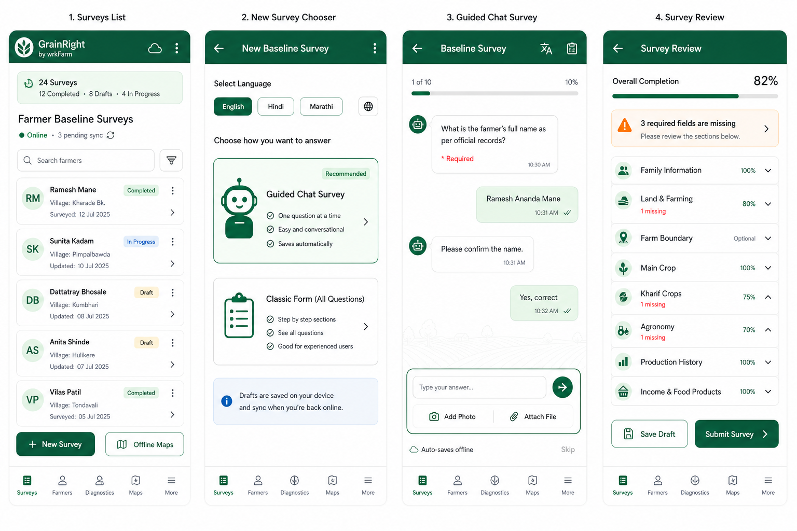
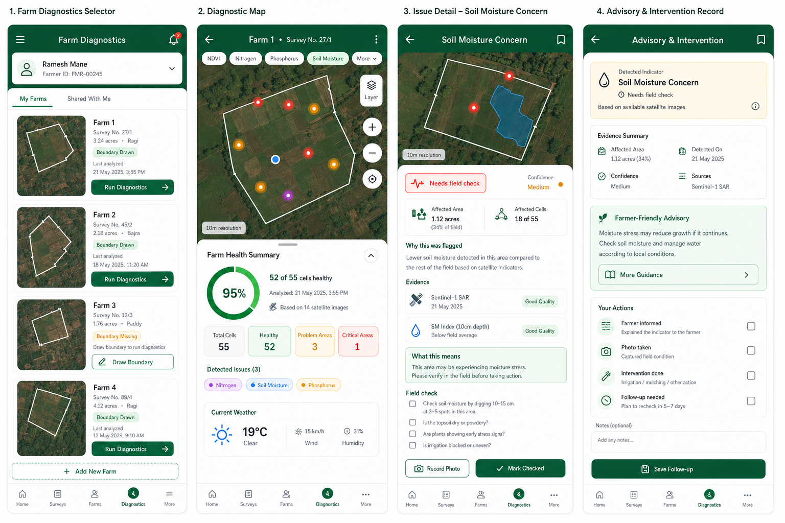
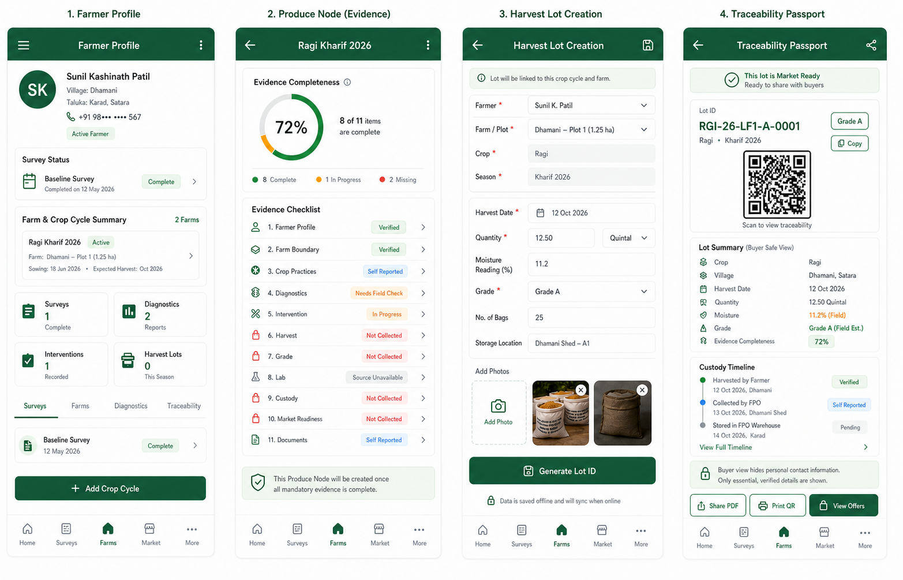
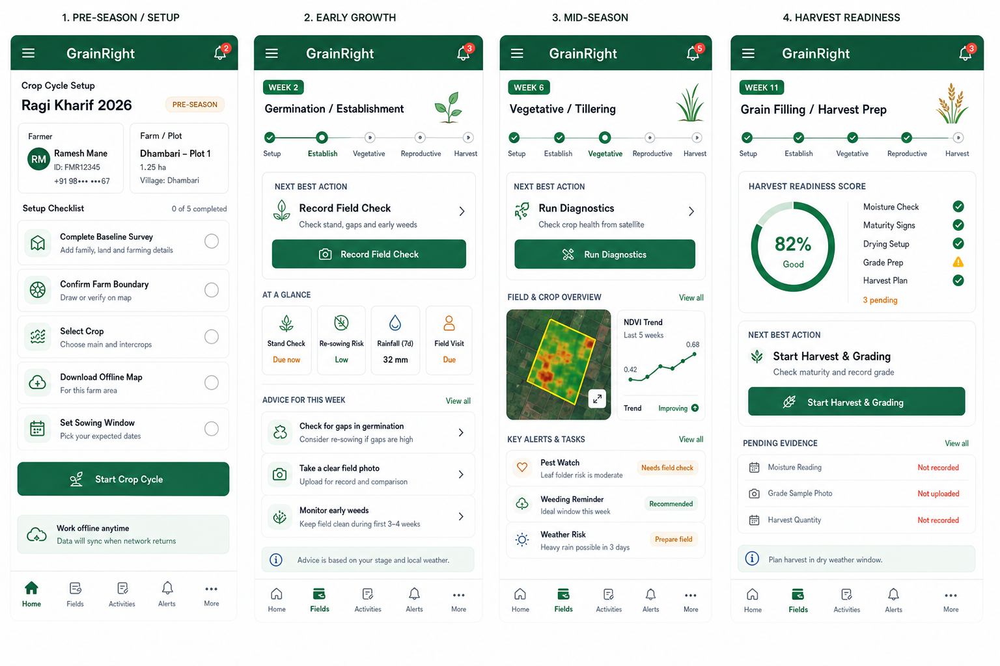
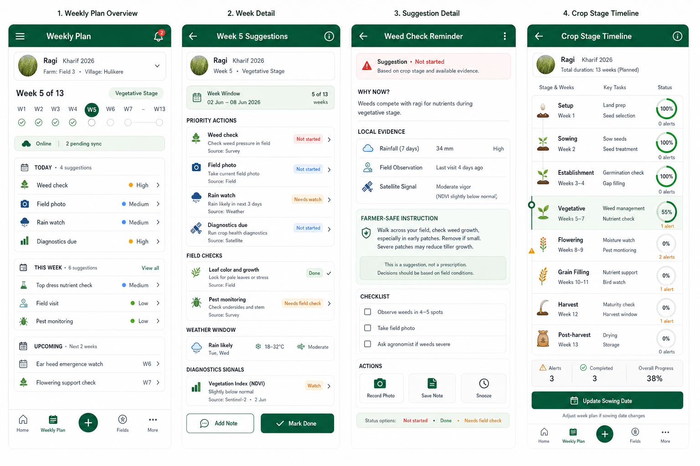
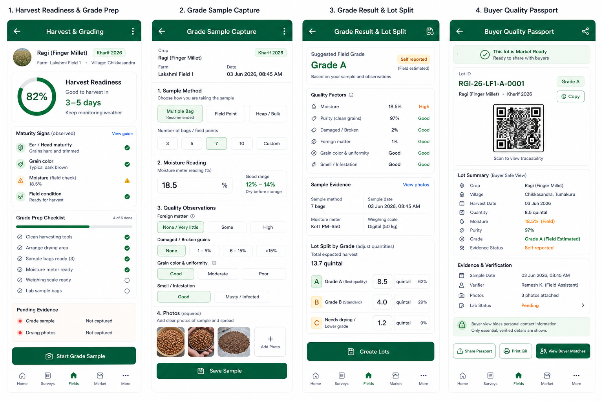

# GrainRight-Based High Fidelity Phone Wireframes

Status: visual handoff  
Generated: 2026-06-03  
Source UI base: `https://github.com/Jashvinu/GrainRight` at latest `main` when generated  
Target app plan: MilletsNow / GrainRight farmer phone app

These boards regenerate the earlier MilletsNow app flows using the current GrainRight Flutter UI as the base visual system.

GrainRight style cues used:

- Deep green Material app bars.
- White scaffold and white cards.
- Thin gray card borders with low or no shadow.
- Pale green selected states and status chips.
- Compact list rows with initials avatars.
- Rounded map and form surfaces.
- Floating chat answer bar.
- Icon-led buttons and simple bottom navigation.
- Operational field-tool layout, not marketing layout.

Note: the GrainRight checkout could not be run as a web app because the latest source imports files that are missing from the repository. The visual base here comes from the pulled source code, app theme, assets, and screen/widget implementation.

## 1. Survey Capture Flow

Use for the survey list, new survey chooser, guided chat survey, and review screen.

## 2. Diagnostics And Advisory Flow

Use for farm selector, diagnostic map, issue detail, and advisory follow-up.

## 3. Traceability And Market Flow

Use for farmer profile, Produce Node, harvest lot creation, and buyer-safe passport.

## 4. Crop Stage Adaptive Layout Flow

Use for how the app dashboard changes from setup to early growth, mid-season monitoring, and harvest readiness.

## 5. Weekly Suggestions Flow

Use for week-by-week crop suggestions, suggestion detail, and crop stage timeline.

## 6. Harvest Grading And Quality Flow

Use for harvest readiness, grade sample capture, grade result, lot split, and buyer quality passport.

## Builder Notes

- Use these GrainRight-based boards as the preferred visual target if the app is now moving under the GrainRight brand.
- Keep data logic from `crop_stage_grading_weekly_layout_expansion.md`.
- Keep survey logic from `farmer_phone_app_full_survey_flow_and_claude_build_prompt.md`.
- Generated image text is directional. Implementation should use real localization strings and validated field labels.
- Safe advisory rules still apply: no unsupported exact fertilizer dose, exact pH, confirmed disease, or guaranteed yield claims.
