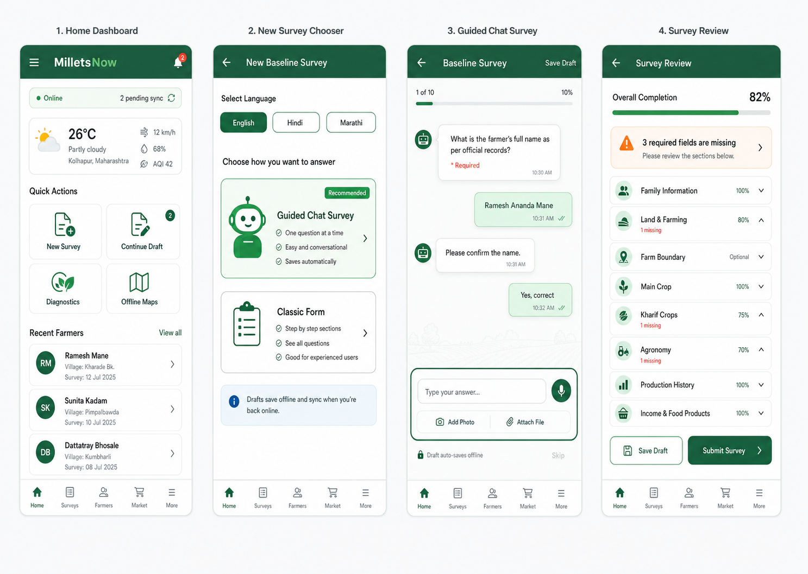
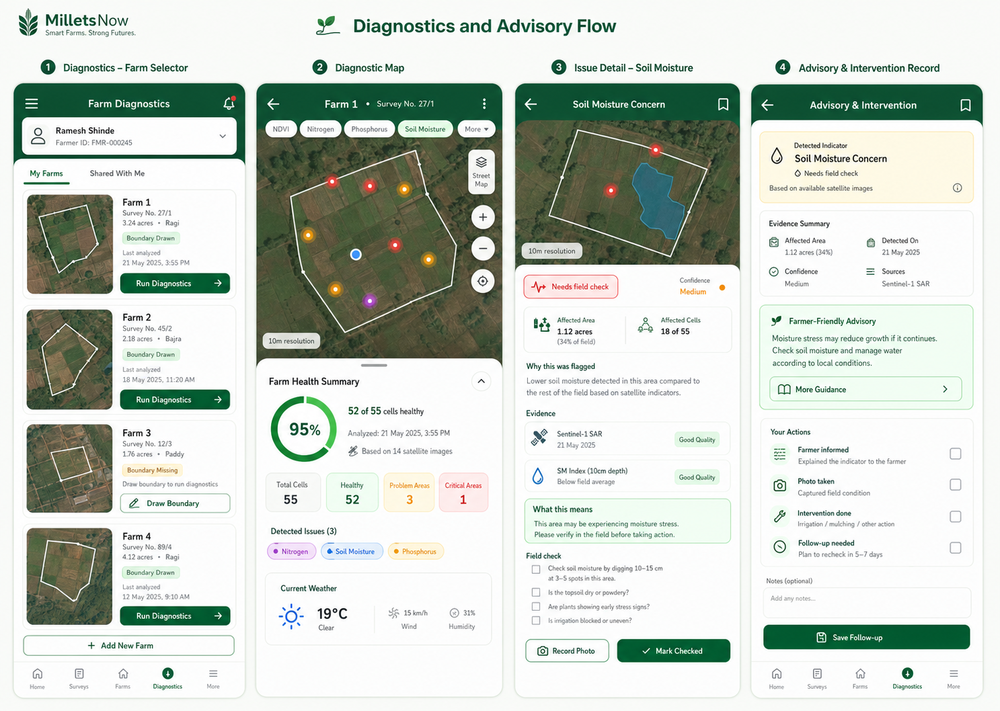
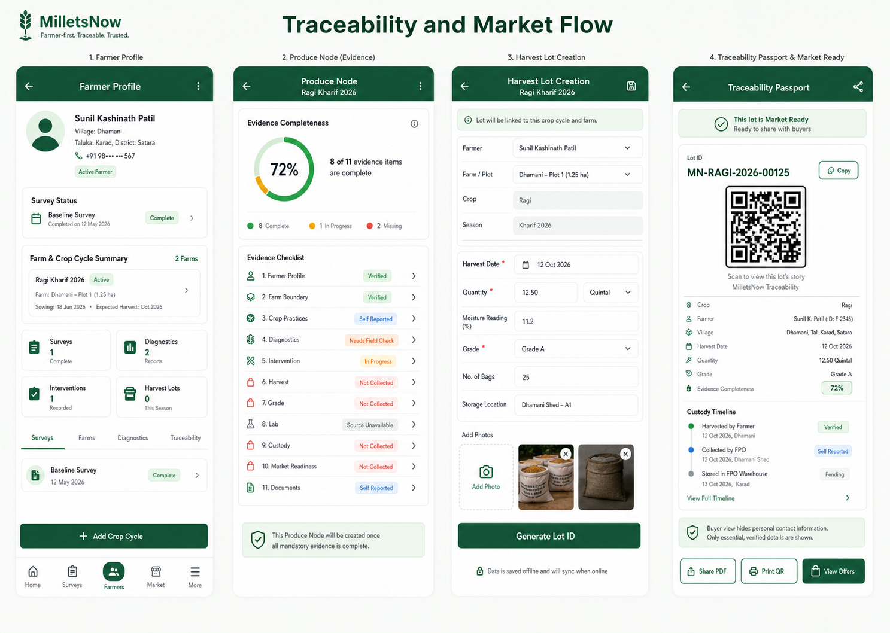
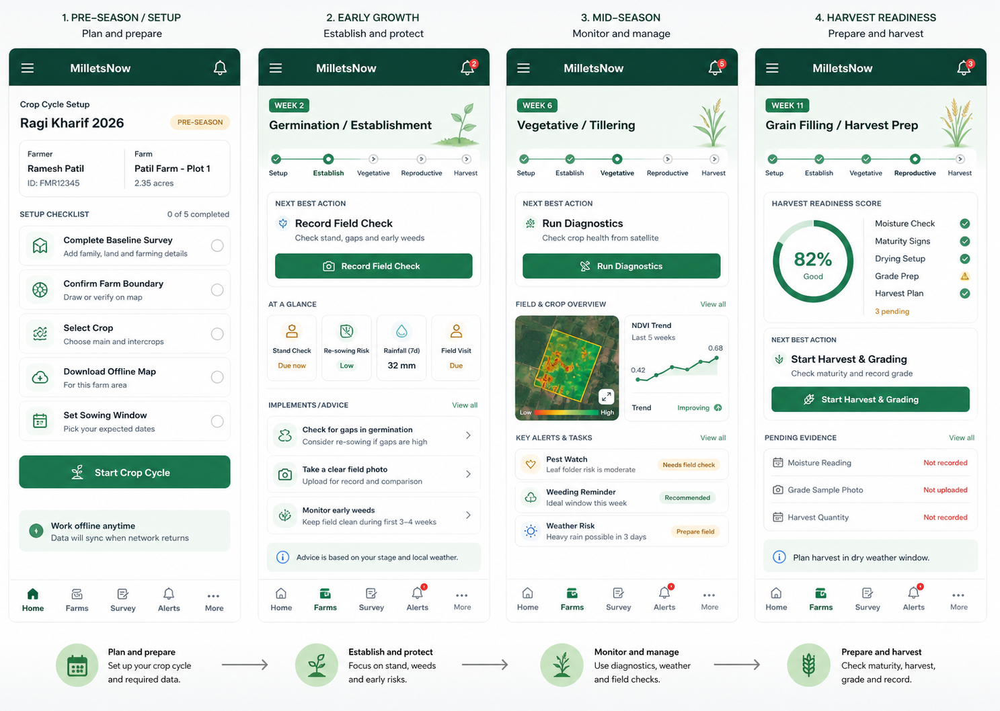
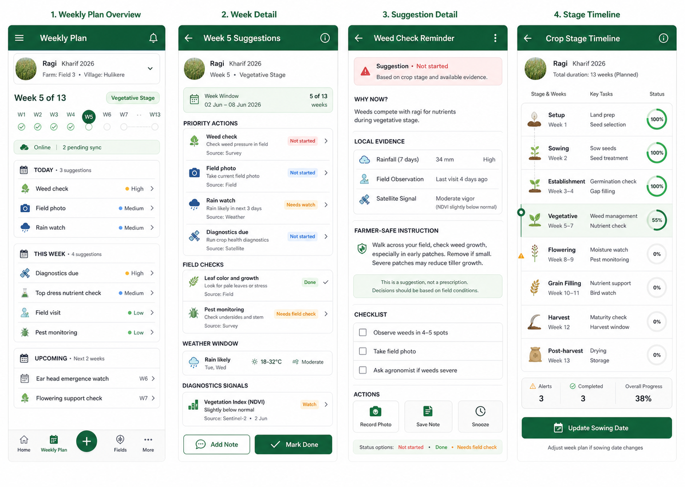
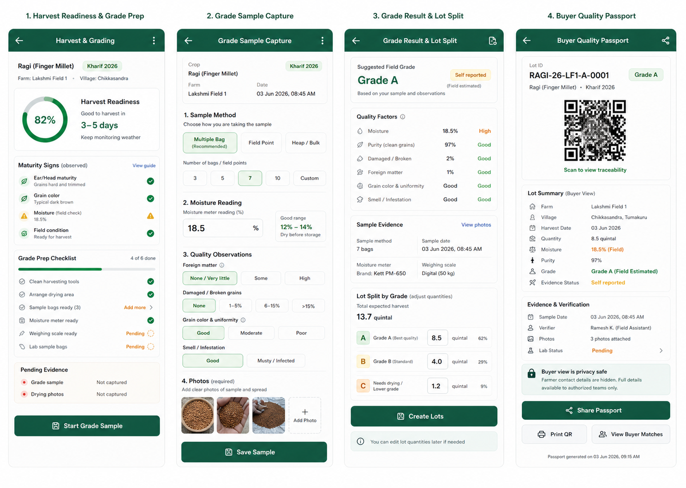

# MilletsNow High Fidelity Phone Wireframes

Status: visual handoff  
Generated: 2026-06-03  
Purpose: high-fidelity mobile layout direction for the farmer app build

These wireframes are visual references for the MilletsNow phone app. Use them for layout, hierarchy, interaction direction, and visual tone. Implement exact labels, validation rules, localization, and data logic from:

- `plans/farmer_phone_app_full_survey_flow_and_claude_build_prompt.md`
- `baseline_survey_form_tree.md`
- `plans/baseline_survey_updated_flow_translations.md`

Do not treat every generated text string in the PNGs as final product copy. The implementation should use repo strings and localization files.

For the newer set regenerated from the pulled GrainRight UI, use:

- `plans/grainright_based_wireframes.md`

## 1. Survey Capture Flow

Use this board for the main field collector experience: home dashboard, survey mode chooser, guided chat survey, and survey review.

Implementation notes:

- Keep the dashboard action-oriented.
- Make pending sync and draft state visible.
- Preserve the chat-first survey route as the recommended capture mode.
- Keep the review screen strict about missing required fields.

## 2. Diagnostics And Advisory Flow

Use this board for the phone version of the diagnostic map and farmer-safe advisory flow.

Implementation notes:

- The diagnostic map should be the primary visual surface.
- Move desktop side-panel information into a draggable bottom sheet.
- Use issue chips for Nitrogen, Soil Moisture, and Phosphorus.
- Use safe wording such as "detected indicator" and "needs field check".
- Do not present satellite-only data as confirmed disease, exact fertilizer dose, exact pH, or guaranteed yield.

## 3. Traceability And Market Flow

Use this board for farmer profile, Produce Node evidence readiness, harvest lot creation, and passport/market handoff.

Implementation notes:

- The Produce Node should honestly show evidence completeness and missing evidence.
- Harvest lots must link back to farmer, farm plot, crop cycle, and survey.
- Buyer-facing passport views must hide sensitive farmer PII.
- Use evidence status labels like verified, self reported, needs field check, source unavailable, and not collected.

## 4. Crop Stage Adaptive Layout Flow

Use this board for how the phone app changes as the crop moves from setup to early growth, mid-season diagnostics, and harvest readiness.

Implementation notes:

- The baseline survey should stop being the main app focus after onboarding.
- The crop cycle dashboard should show the active week, stage, timeline chips, and next best action.
- Layout emphasis should change by stage: setup checklist, field check, diagnostics, harvest readiness, then grading and market.
- Updating sowing date should shift the stage timeline and weekly plan.

## 5. Weekly Suggestions Flow

Use this board for week-by-week suggestions, stage timeline, and suggestion detail screens.

Implementation notes:

- Suggestions should be generated from a configurable crop-stage template.
- Each suggestion should show source labels such as crop stage, survey, weather, satellite, field, or agronomist.
- Suggestion statuses should include not started, done, needs field check, snoozed, and follow-up needed.
- Use cautious language: suggestion, field check, and based on available evidence.

## 6. Harvest Grading And Quality Flow

Use this board for harvest readiness, grade sample capture, grade result, lot split, and buyer quality passport.

Implementation notes:

- Separate field-estimated grade, verified grade, and lab grade.
- Capture moisture, foreign matter, damaged or broken grain, color and uniformity, smell or infestation, photos, and verifier.
- Allow one harvest to split into multiple lots by grade or quality condition.
- Buyer-facing quality passport must show grade proof while hiding sensitive farmer PII.

## Suggested Build Order

1. Stabilize survey capture and review.
2. Add the dashboard and sync visibility.
3. Build the phone diagnostics map and issue detail.
4. Add advisory/intervention records.
5. Add crop-stage dashboard and week-by-week suggestions.
6. Add harvest readiness and grading.
7. Add Produce Node, harvest lot, and passport preview.
8. Add market linkage screens.
