# Survey Flow Screenshots

Captured from the Flutter web release build at a 393 x 852 mobile viewport with 2x pixel density. The classic form flow uses an existing populated survey and stops on the final `Submit` screen without submitting.

1. Login / guest entry  
   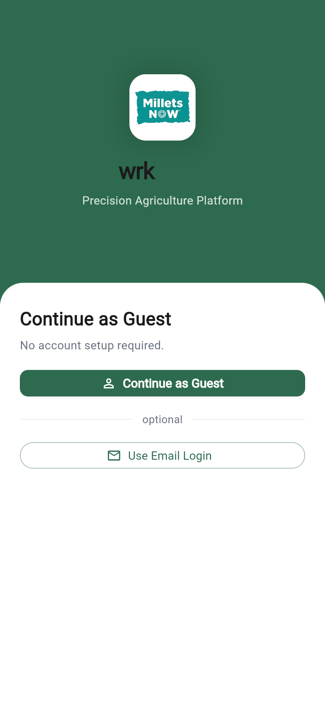

2. Module selection  
   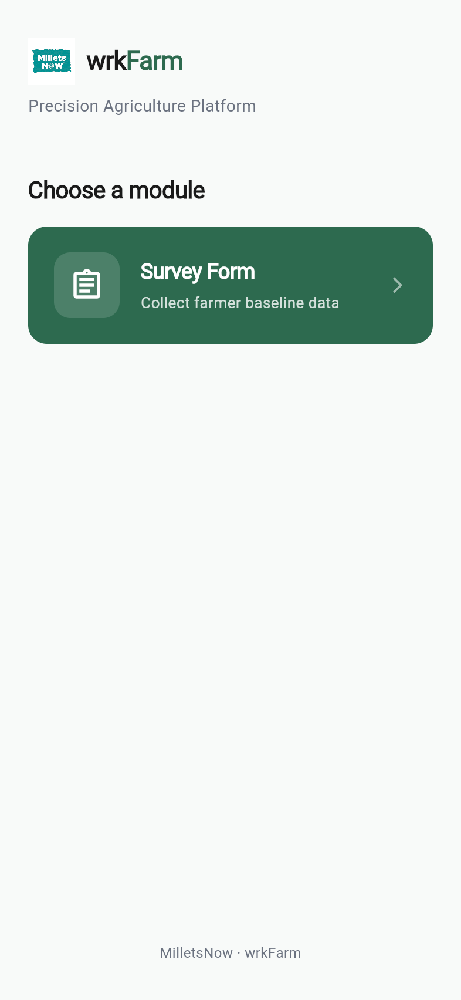

3. Survey list  
   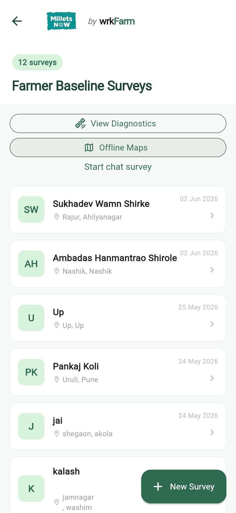

4. Chat survey language selection  
   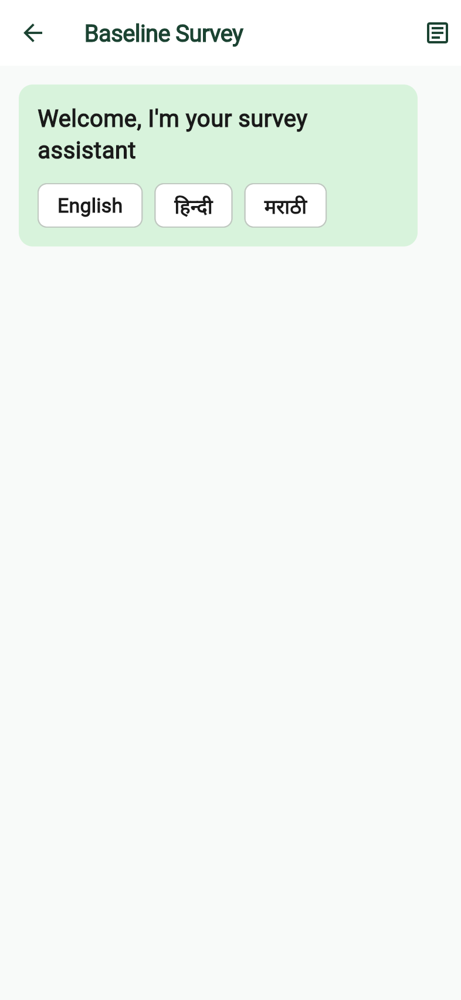

5. Chat survey first question  
   

6. Chat survey typed answer  
   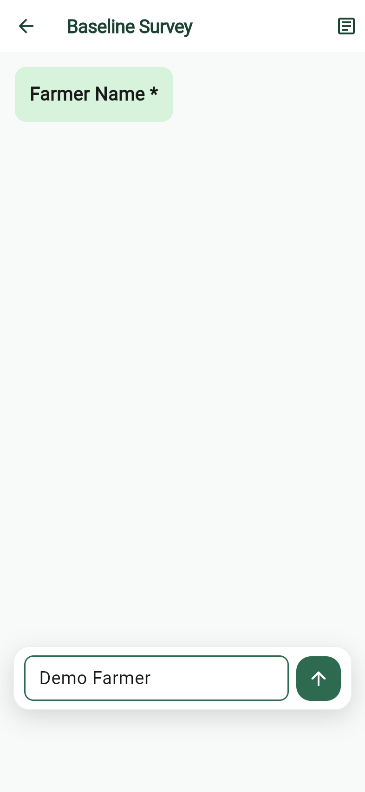

7. Chat survey next question  
   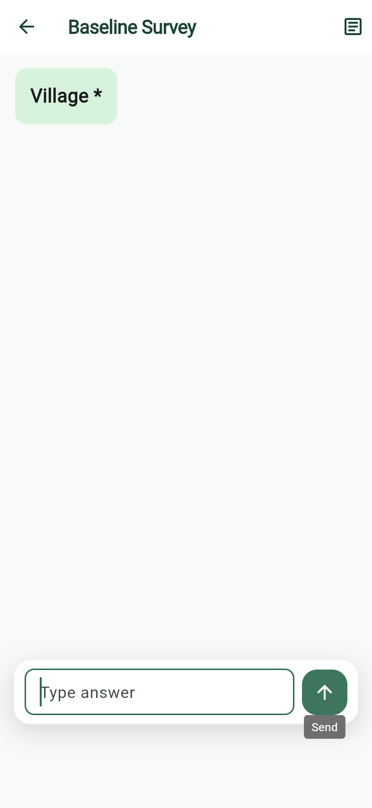

8. Classic form step 1  
   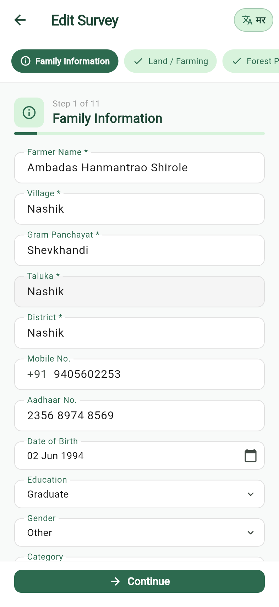

9. Classic form step 2  
   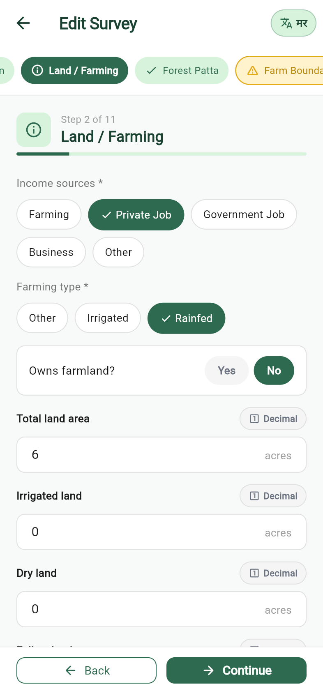

10. Classic form step 3  
    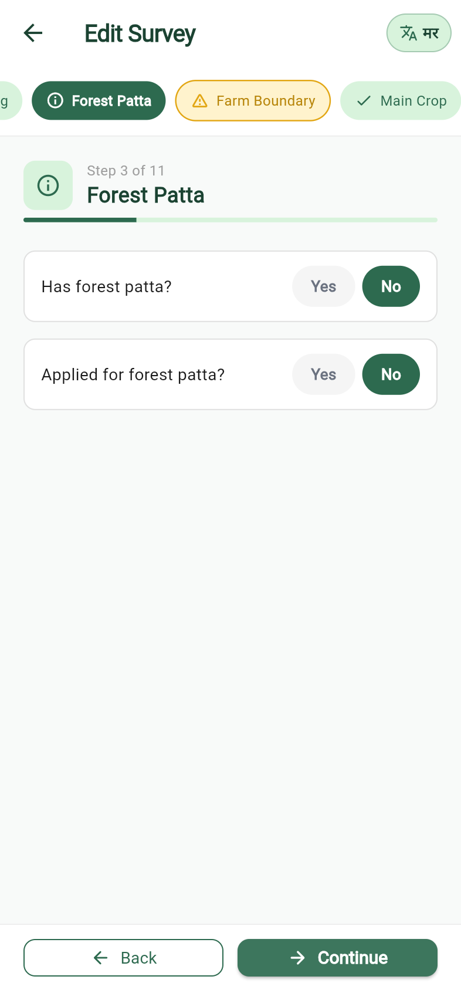

11. Classic form step 4  
    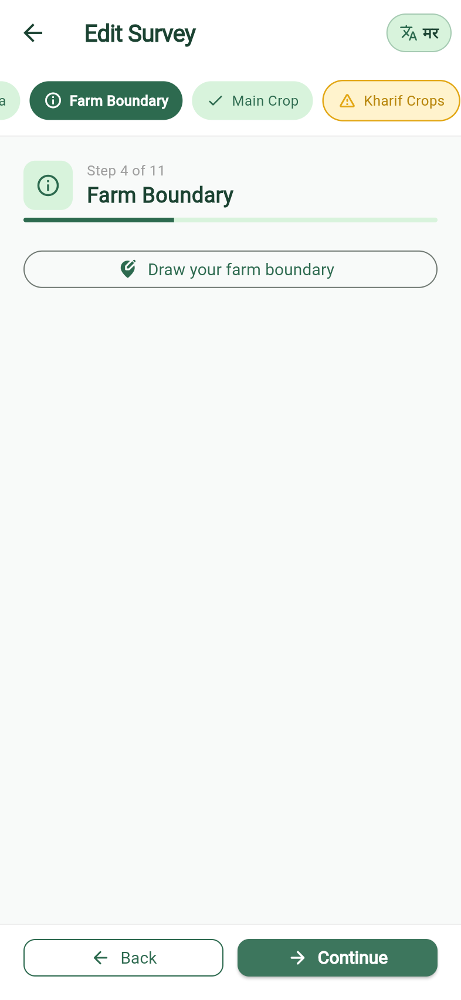

12. Classic form step 5  
    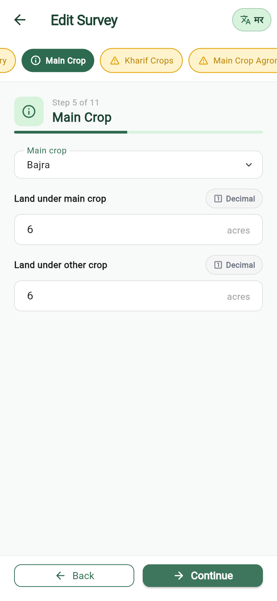

13. Classic form step 6  
    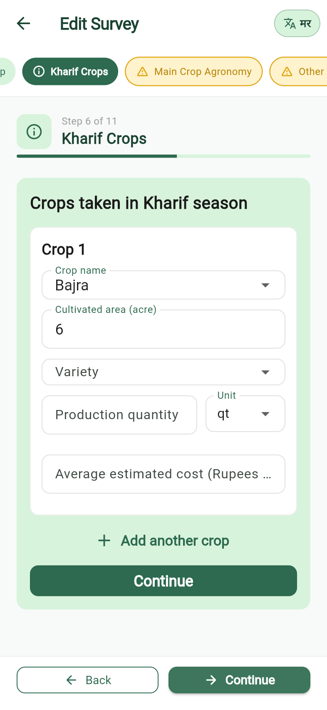

14. Classic form step 7  
    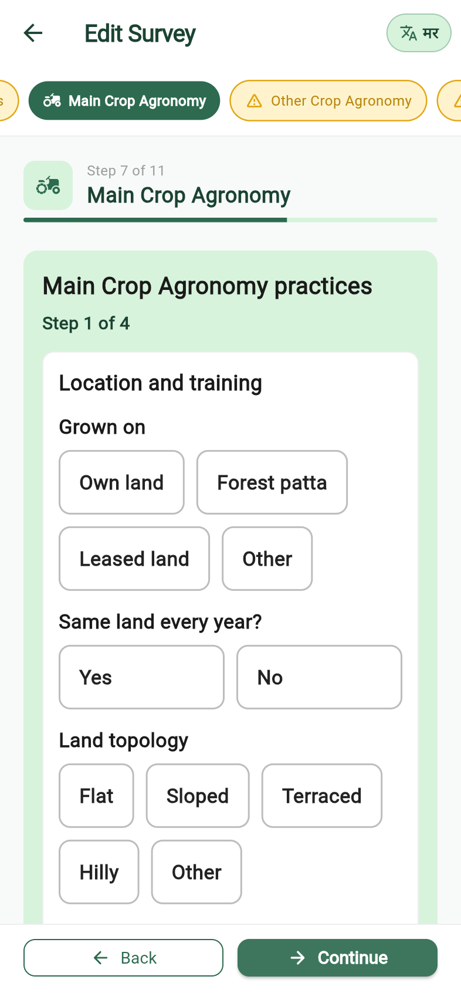

15. Classic form step 8  
    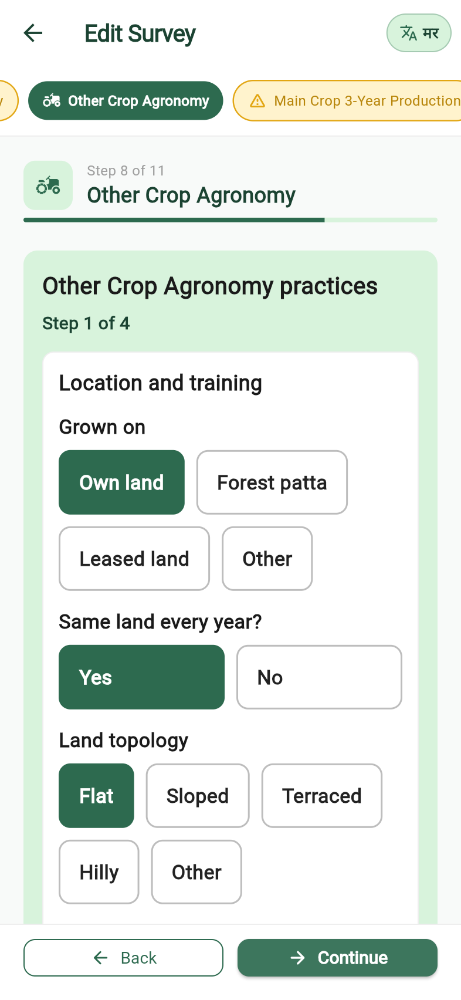

16. Classic form step 9  
    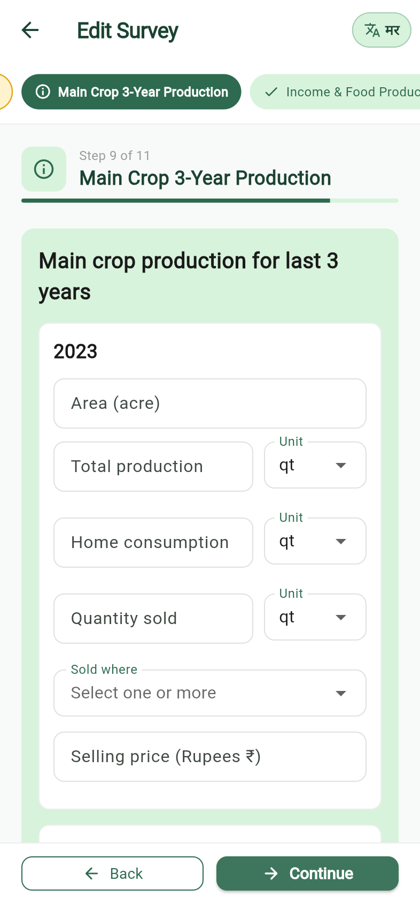

17. Classic form step 10  
    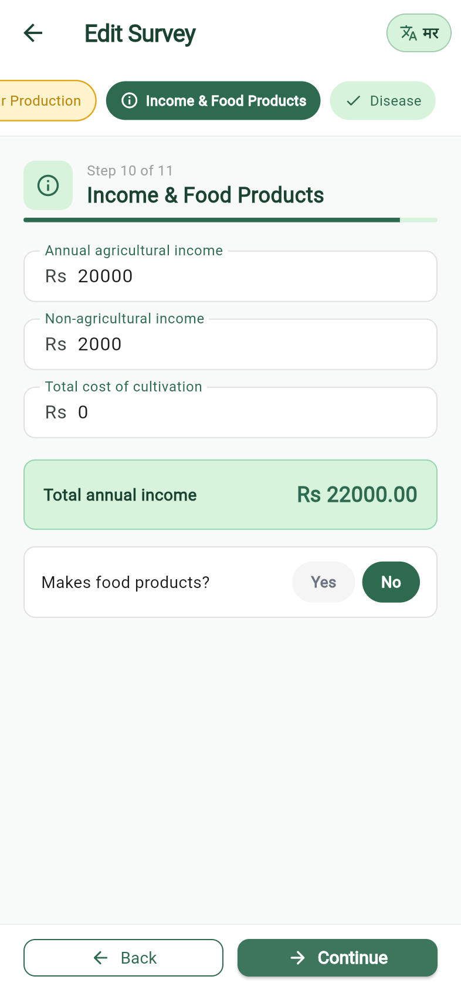

18. Classic form step 11  
    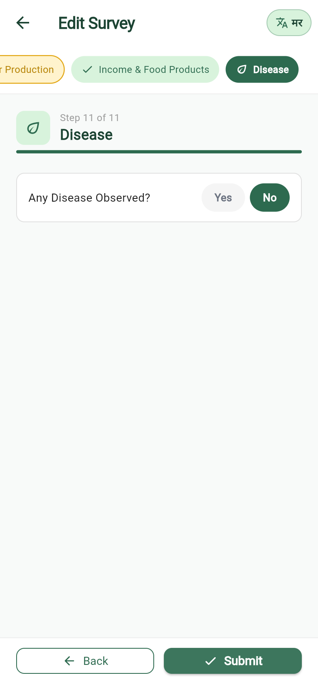
